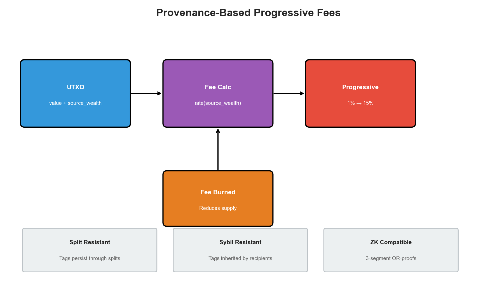
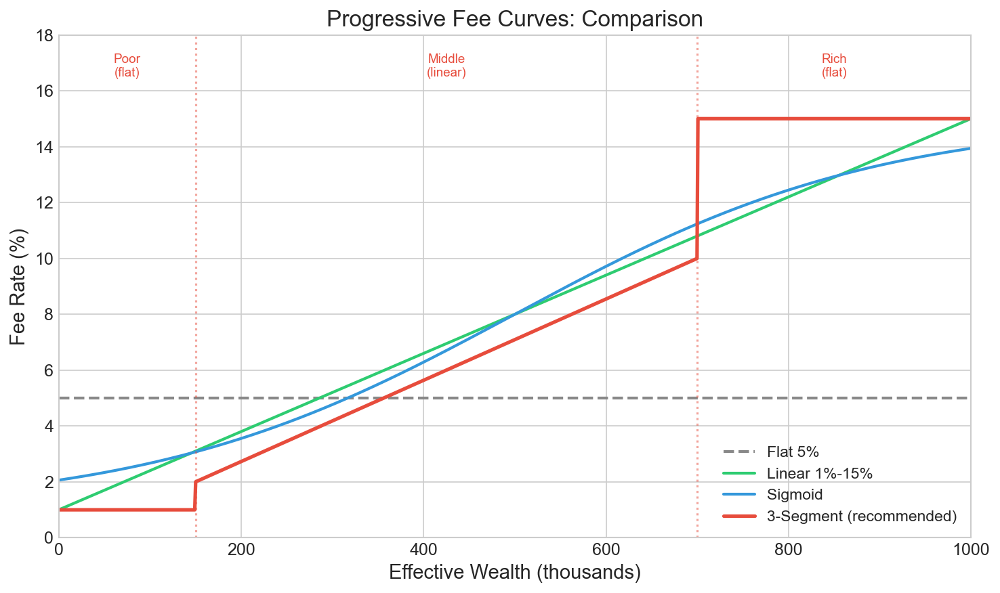
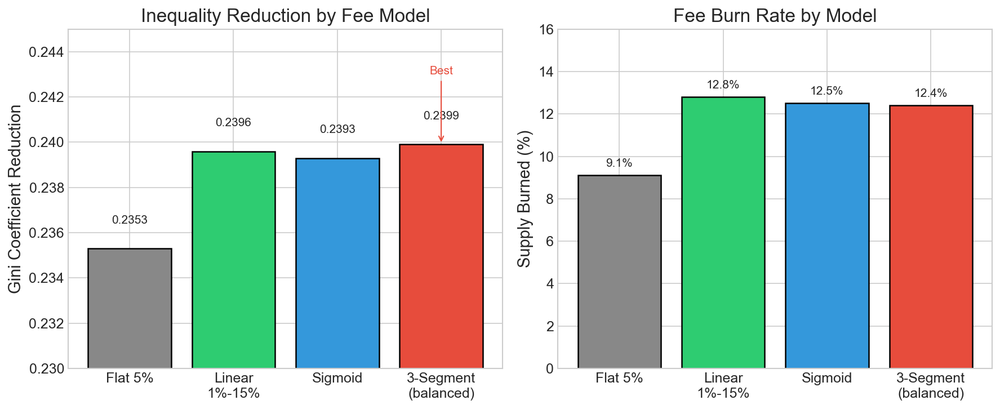
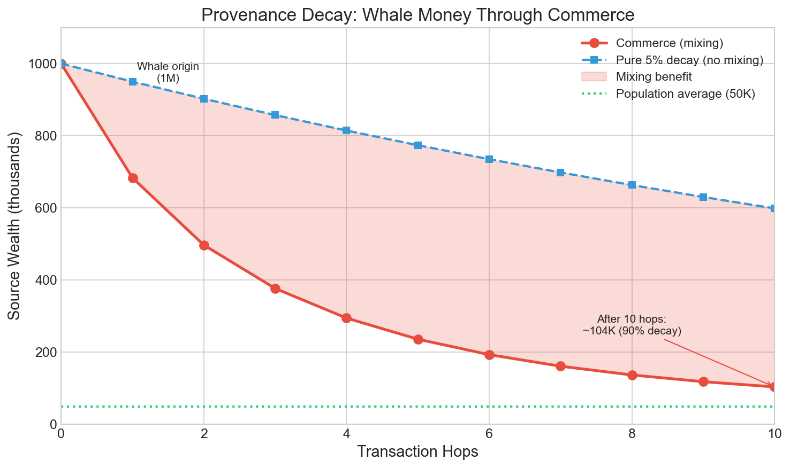

# Cluster Tax Documentation

Progressive transaction fees based on coin provenance, designed to reduce wealth inequality while being resistant to sybil attacks and compatible with zero-knowledge proofs.



## Overview

| Document | Description |
|----------|-------------|
| [provenance_fees.md](provenance_fees.md) | Core design: why provenance tags defeat splitting attacks |
| [wealth_cluster_tax.md](wealth_cluster_tax.md) | Economic rationale for taxing wealth clusters |
| [privacy_analysis.md](privacy_analysis.md) | Privacy implications and cryptographic solutions |
| [piecewise_linear_fee_curve.md](piecewise_linear_fee_curve.md) | ZK-compatible fee curve design |

## Quick Summary

### The Problem

Naive progressive fees (based on transaction amount) are defeated by splitting:
```
Whale: 1M coins at 10% rate = 100K fee
Split: 1000 × 1K coins at 1% rate = 10K fee (90% savings)
```

### The Solution

Coins carry **provenance tags** that persist through splits:


Fee is based on `source_wealth`, not `value`. Splitting doesn't help.

### Key Properties

| Property | Behavior |
|----------|----------|
| Split resistance | source_wealth unchanged by splitting |
| Sybil resistance | source_wealth inherited by recipients |
| Blend on combine | Multiple inputs → weighted average |
| Natural decay | Legitimate commerce reduces effective_wealth |

### ZK-Compatible Fee Curve

For Phase 2 (committed tags), we use a 3-segment piecewise linear curve:



```
Poor:   [0, 15%)     → 1% flat
Middle: [15%, 70%)   → 2% to 10% linear
Rich:   [70%+]       → 15% flat
```

### Simulation Results



- **-0.2399 Gini reduction** (0.3% better than sigmoid)
- **12.4% burn rate** (0.1% less than sigmoid)
- **~4.5 KB proof overhead** (3 OR-proofs)

### Natural Decay Through Commerce

Whale money naturally normalizes as it circulates through the economy:



## Reference Implementation

See `scripts/provenance_reference.py` for a clean Python implementation with correctness tests:

```bash
python scripts/provenance_reference.py
```

Tests verify: split resistance, sybil resistance, blend on combine, whale pays more, legitimate commerce decay.

## Simulation Scripts

| Script | Purpose |
|--------|---------|
| `scripts/provenance_reference.py` | Reference implementation with correctness tests |
| `scripts/gini_3segment.py` | 3-segment fee curve Gini simulation |
| `scripts/gini_simple_utxo.py` | UTXO-based progressive fee simulation |

## Figures

All figures are in `docs/figures/` and can be regenerated with:

```bash
.venv/bin/python scripts/generate_figures.py
```

| Figure | Description |
|--------|-------------|
| `system_overview.png` | High-level system diagram |
| `fee_curves_comparison.png` | Comparison of fee curve models |
| `gini_reduction_comparison.png` | Inequality reduction by model |
| `provenance_decay.png` | Source wealth decay through commerce |
| `split_resistance.png` | How tags defeat splitting attacks |
| `whale_vs_poor.png` | Fee difference by wealth level |

## Tracking

Phase 2 implementation tracked in [Issue #69](https://github.com/botho-project/botho/issues/69).
