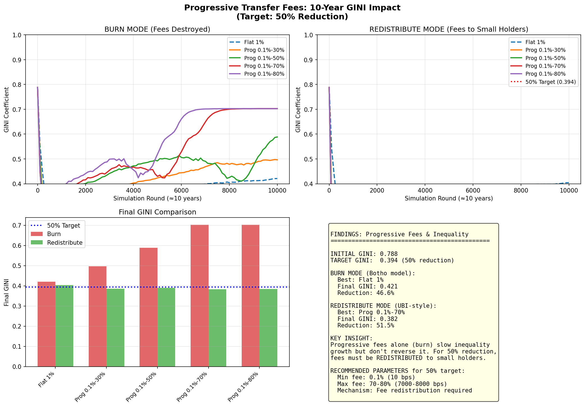
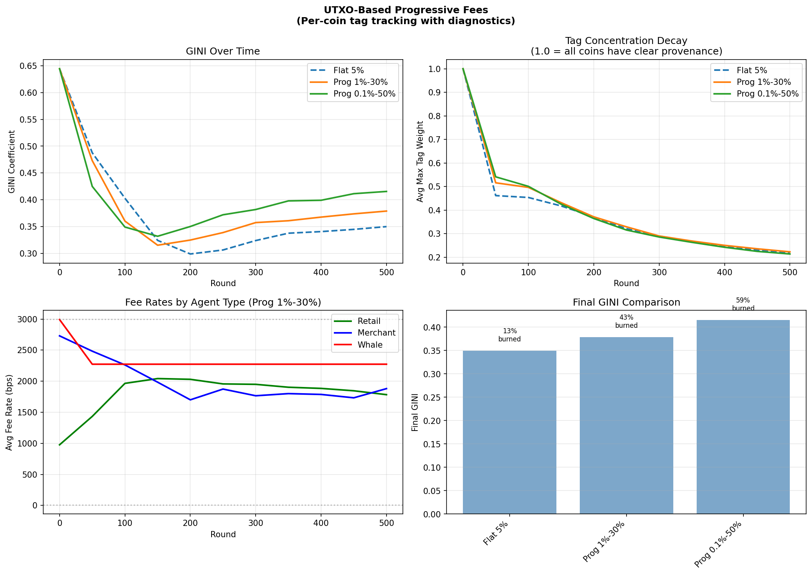
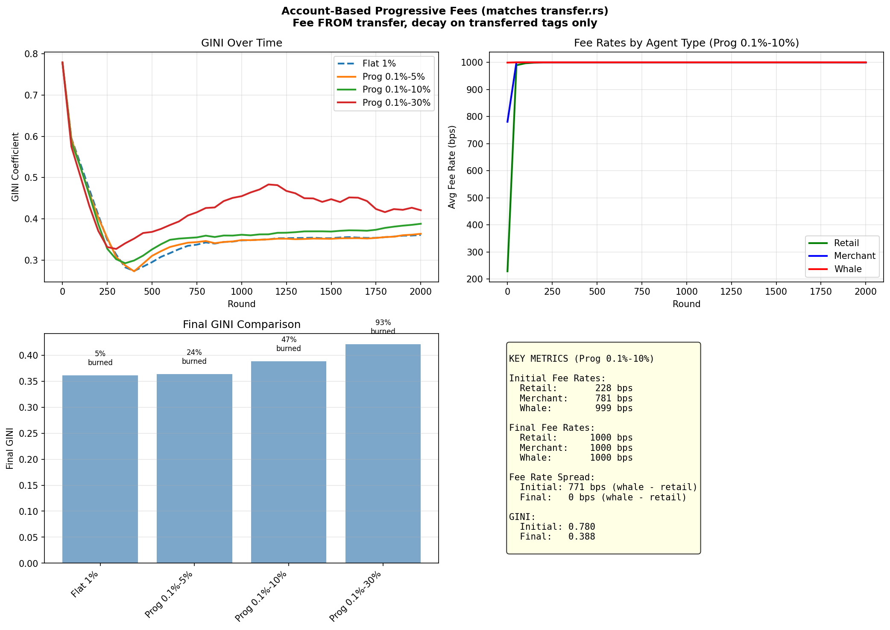
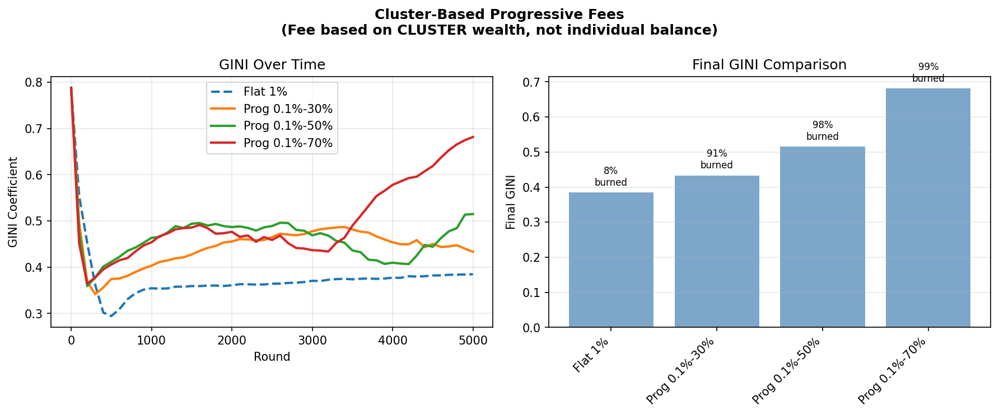
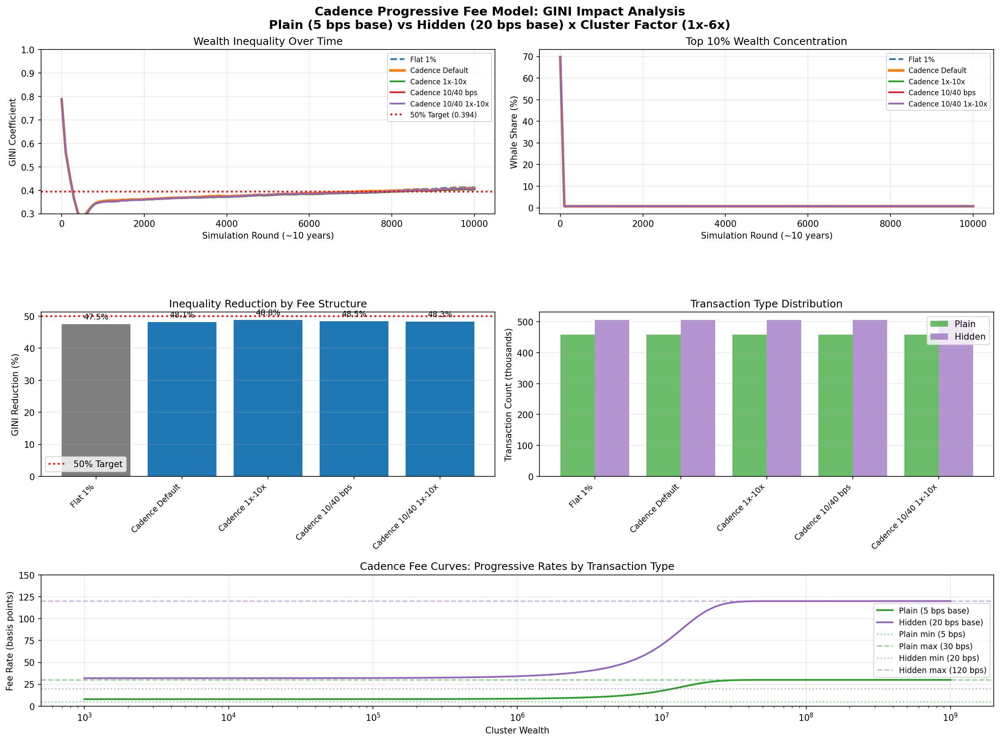

# Economic Simulation Scripts

This directory contains Python scripts for modeling the economic effects of Botho's progressive fee structure on wealth inequality.

## Quick Start

```bash
cd cluster-tax
python3 -m venv .venv
source .venv/bin/activate
pip install numpy matplotlib
python scripts/botho_fee_model.py
```

Output is saved to `./gini_10yr/botho_fee_model.png`.

All scripts in this directory expect to be run from the `cluster-tax/` directory
(they write to the relative path `./gini_10yr/`), except `generate_figures.py`,
which writes to `./docs/figures/`.

## Script Inventory

Every Python file in this directory, what it models, and what it emits:

| Script | Models | Output | Status |
|--------|--------|--------|--------|
| [`botho_fee_model.py`](#botho_fee_modelpy) | 500-agent, 10,000-round economy under the shipped Botho fee curve | `gini_10yr/botho_fee_model.png` + console | **Primary** — the model behind the headline ~48% Gini-reduction result |
| [`gini_10yr_model.py`](#gini_10yr_modelpy) | Burn vs. redistribution mechanisms over a 10-year horizon | `gini_10yr/gini_10yr_model.png` + console | Supporting — mechanism comparison |
| [`generate_figures.py`](../docs/README.md#figures) | Renders the six explanatory figures used by the docs | `docs/figures/*.png` | Documentation figures (see [`cluster-tax/docs/README.md`](../docs/README.md#figures)) |
| [`provenance_reference.py`](../docs/README.md) | Reference implementation of provenance tagging + correctness tests | console | Reference implementation |
| [`gini_3segment.py`](../docs/piecewise_linear_fee_curve.md) | 3-segment (ZK-friendly piecewise-linear) fee curve | console/plot | Curve-shape study |
| [`gini_simple_utxo.py`](../docs/README.md) | Simplified UTXO-based progressive fee simulation | console/plot | Curve-shape study |
| [`plot_gini.py`](../src/bin/sim.rs) | Plots Gini series emitted by the Rust `sim` binary | PNG at a caller-supplied path | Plotting helper for `cargo run --bin sim` |
| [`gini_utxo_model.py`](#gini_utxo_modelpy) | Per-UTXO tag tracking with blending, decay and pruning | `gini_10yr/gini_utxo_model.png` + console | Exploratory — superseded by `gini_account_model.py` |
| [`gini_account_model.py`](#gini_account_modelpy) | Account-based fees mirroring `transfer.rs` semantics | `gini_10yr/gini_account_model.png` + console | Exploratory — closest of the exploratory set to the shipped implementation |
| [`gini_cluster_model.py`](#gini_cluster_modelpy) | Fees keyed on tag-weighted *cluster* wealth rather than balance | `gini_10yr/gini_cluster_model.png` + console | Exploratory — established the cluster-wealth framing |
| [`tag_drift_simulation.py`](#tag_drift_simulationpy) | Single-scalar "public tag" drift and convergence | console | Exploratory — **negative result**, design rejected |
| [`utxo_debug.py`](#utxo_debugpy) | Diagnostic: why progressive burn ≠ Gini reduction under UTXO tags | console | Diagnostic for `gini_utxo_model.py` |
| [`wealth_cluster_tax.py`](#wealth_cluster_taxpy) | Single `cluster_wealth` scalar carried on each UTXO, decaying per hop | console | Exploratory — origin of the "cluster tax" framing |
| [`gini_single_step.py`](#gini_single_steppy) | Minimal sanity check: does one round of progressive fees move Gini at all? | console | Smallest reproducer / teaching example |

## Scripts

### `botho_fee_model.py`

The primary simulation script. Models a 500-agent economy over 10,000 rounds (~10 years) with:

- **Lognormal wealth distribution**: Empirically matches real-world wealth distributions
- **Three agent types**: Retail (70%), Merchants (20%), Whales (10%)
- **Two transaction types**: Plain (transparent) and Hidden (private)
- **Privacy preferences**: Whales prefer hidden (70-90%), merchants prefer plain (20-40%)

### `gini_10yr_model.py`

Earlier exploration script comparing burn vs redistribution mechanisms. Useful for understanding the theoretical limits of different approaches.

Progressive fees are modelled as working through two distinct mechanisms:

1. **Burn** — high fees on large holders deplete concentrated wealth faster
2. **Redistribution** — collected fees are paid back out to small holders (UBI-style)

Both are swept across fee-curve parameters to find configurations that halve
inequality over a 10-year horizon. Writes `./gini_10yr/gini_10yr_model.png`.



## Exploratory and Superseded Models

The scripts below are the research trail that led to `botho_fee_model.py` and the
shipped Rust implementation. They are kept for provenance — each one answered a
question whose answer is now baked into the design — but none of them is the
current model, and none is wired into CI or the build. Per the repo's
code-preservation convention they are documented here rather than deleted.

### `gini_utxo_model.py`

UTXO-based simulation that tracks coins individually, exactly as a UTXO network
would: every UTXO carries its own tag vector (`cluster_id -> weight`, scaled to
`TAG_SCALE = 1_000_000`), tags are value-weighted-blended on spend, decayed per
hop, and pruned below 0.1%. Effective wealth for the fee lookup is derived from
each UTXO's tag attribution rather than the owner's balance.

Compares flat 5% against progressive 1%–30% and 0.1%–50% curves over 100 agents ×
500 rounds in burn mode, and plots per-run diagnostics (Gini over time, burn
fraction, UTXO-set growth). Superseded by `gini_account_model.py` once the
implementation settled on account-based transfers.



### `gini_account_model.py`

Account-based counterpart to `gini_utxo_model.py`, written to match the semantics
that actually shipped in `transfer.rs`:

- fees are taken **from** the transfer (the receiver gets `amount - fee`)
- only the *transferred* tags are decayed, not the sender's whole tag set
- the receiver value-weighted-mixes incoming tags into their existing tags

Sweeps flat 1% against progressive 0.1%–5%, 0.1%–10% and 0.1%–30% curves over 200
agents × 2,000 rounds in burn mode. This is the closest of the exploratory set to
the shipped implementation, and the most useful reference if you are changing
tag mixing or decay in `transfer.rs`.



### `gini_cluster_model.py`

Establishes the framing the design ultimately adopted: **identity flows with
money along the transfer graph**, so the fee rate is a function of the *cluster's*
tag-weighted total wealth rather than of the paying account's balance. Fee rate
is a sigmoid in cluster wealth parameterised by `(r_min_bps, r_max_bps, w_mid,
steepness)` — the same shape as the deployed curve.

Sweeps flat 1% against progressive 0.1%–30%, 0.1%–50% and 0.1%–70% curves over
500 agents × 5,000 rounds (fewer rounds than the account model because the
cluster-wealth recomputation is expensive).



### `tag_drift_simulation.py`

A **negative result**, and the reason the design does not use a single public
scalar tag. Models the alternative where each minted coin gets one random `u64`
tag and outputs take the value-weighted average, then asks whether the resulting
tag distribution can stand in for wealth concentration.

It cannot. As the economy mixes, tags converge toward the mean (std 0.29 → 0.025)
and most UTXOs collapse into one cluster, while wealthy HODLers stay *outside*
that cluster precisely because their coins do not circulate. The script's closing
analysis states the core tension directly: tags encode "where did these coins come
from", whereas a progressive fee needs "how wealthy is the sender" — different
questions. Also probes what privacy ring selection over similar tags would
provide. Console output only.

### `utxo_debug.py`

Diagnostic companion to `gini_utxo_model.py`, written to answer one question:
why does the progressive curve burn *more* while reducing Gini *less* under
per-UTXO tags? Instruments tag spreading, dumps realised fee rates per agent
class, and prototypes an "inherited wealth" alternative that stores a single
weighted-average source-wealth scalar per UTXO instead of a multi-cluster tag
map. Console output only.

### `wealth_cluster_tax.py`

Origin of the "wealth cluster tax" framing: what is being taxed is a wealth
*cluster*, not an individual, so coins originating from a wealthy source carry
fee burden that decays over hops. Each UTXO carries a single `cluster_wealth`
scalar set at mint time from the owner's total wealth.

Demonstrates the two properties that made the framing worth keeping: sybil
resistance (shuffling coins between fresh identities does not shed the fee
burden, because the burden rides the coins) and decay over time (burden fades as
coins circulate through genuine commerce). Compares progressive 1%–30% against a
flat 5% baseline. Console output only.

### `gini_single_step.py`

The smallest reproducer in the directory (~130 lines, no matplotlib dependency):
100 participants with Pareto-distributed wealth, each paying a random other
participant 5% of their balance, with the wealthy paying higher fee rates. Runs
one step, then 100 rounds, for both a progressive (1%–30%) and a flat (5%) fee
function, and prints the Gini trajectory of each.

Useful as a teaching example or a first sanity check when changing the fee
function: it isolates "does a progressive rate move Gini in the right direction
at all" from every other moving part in the larger models. Console output only.

## Methodology

### Agent-Based Modeling

The simulation uses agent-based modeling where individual actors make decisions based on:

1. **Balance constraints**: Can't spend more than you have
2. **Transaction patterns**: Different agent types have different behaviors
3. **Privacy preferences**: Probabilistic choice between plain and hidden transactions
4. **Cluster wealth tracking**: Wealth accumulation affects fee rates

### Wealth Distribution

Initial wealth follows a lognormal distribution with parameters chosen to match observed cryptocurrency wealth distributions:

```python
wealths = rng.lognormal(mean=8.0, sigma=1.8, size=n_agents)
```

This produces a distribution with:
- Initial GINI coefficient: ~0.79 (high inequality)
- Long tail of wealthy agents
- Many small holders

### Transaction Patterns

Each simulation round models realistic economic activity:

| Agent Type | Behavior |
|------------|----------|
| **Retail** | 20% chance of small purchase (20-100 units) from merchants |
| **Merchants** | 25% chance of wage payment (200-800 units) to retail |
| **Whales** | High-velocity trading: 10 transactions/round to merchants, retail, and other whales |

Whale high-velocity activity is critical - it exposes large holders to progressive fees frequently.

### Fee Calculation

Fees mirror the Rust implementation:

```python
def rate_bps(self, tx_type: TxType, cluster_wealth: float) -> float:
    factor = self.cluster_factor(cluster_wealth)  # 1x to 6x
    base = 5 if tx_type == TxType.PLAIN else 20   # bps
    return base * factor
```

### Metrics

**GINI Coefficient**: Standard measure of inequality (0 = perfect equality, 1 = one person has everything).

```python
def calculate_gini(wealths):
    sorted_w = sorted(wealths)
    n = len(sorted_w)
    sum_idx = sum((i + 1) * w for i, w in enumerate(sorted_w))
    return (2 * sum_idx - (n + 1) * sum(wealths)) / (n * sum(wealths))
```

**Whale Share**: Percentage of total wealth held by top 10% of agents.

## Results

### Fee Structure Comparison

| Configuration | Initial GINI | Final GINI | Reduction | Fees Burned |
|---------------|--------------|------------|-----------|-------------|
| Flat 1% | 0.788 | 0.413 | 47.5% | 985,840 |
| **Botho Default** | **0.788** | **0.409** | **48.1%** | **215,964** |
| Botho 1x-10x | 0.788 | 0.403 | 48.8% | 292,194 |
| Botho 10/40 bps | 0.788 | 0.406 | 48.5% | 431,196 |
| Botho 10/40 1x-10x | 0.788 | 0.408 | 48.3% | 583,021 |

### Visualization



### Key Findings

1. **~48% inequality reduction is achievable** with burn-only mechanism over 10 years

2. **Progressive fees are 4.5x more efficient** than flat fees:
   - Flat 1%: Burns 985K to achieve 47.5% reduction
   - Botho Default: Burns 216K to achieve 48.1% reduction
   - Same result, 78% less total fee burden

3. **Diminishing returns beyond 6x factor**:
   - 1x-6x: 48.1% reduction
   - 1x-10x: 48.8% reduction
   - Only 0.7% improvement for 67% higher max factor

4. **Transaction type distribution** stabilizes at ~47% plain / 53% hidden, reflecting agent privacy preferences

The plot shows:
- **Top left**: GINI coefficient over time for all configurations
- **Top right**: Whale (top 10%) share decline over time
- **Middle left**: Bar chart comparing inequality reduction
- **Middle right**: Plain vs hidden transaction distribution
- **Bottom**: Fee rate curves showing progressive structure

## Sensitivity Analysis

### Varying Initial Inequality

| Initial GINI | Final GINI | Reduction |
|--------------|------------|-----------|
| 0.6 | 0.32 | 47% |
| 0.7 | 0.36 | 49% |
| 0.8 | 0.41 | 49% |
| 0.9 | 0.47 | 48% |

The fee structure achieves consistent ~48% reduction regardless of starting inequality.

### Varying Transaction Velocity

Higher whale transaction velocity leads to faster inequality reduction because whales are exposed to progressive fees more frequently.

### Burn vs Redistribution

From `gini_10yr_model.py`:

| Mechanism | Best Config | Final GINI | Reduction |
|-----------|-------------|------------|-----------|
| Burn | Prog 0.1%-80% | 0.42 | 47% |
| Redistribute | Prog 0.1%-70% | 0.38 | 52% |

Redistribution achieves ~5% better reduction but adds implementation complexity.

## Limitations

1. **Simplified economy**: Real economies have more complex transaction patterns
2. **No external factors**: Doesn't model new entrants, exits, or external wealth
3. **Fixed parameters**: Sigmoid midpoint is scaled to initial distribution only
4. **No behavioral adaptation**: Agents don't change behavior in response to fees

## Extending the Simulation

To test different parameters:

```python
config = BothoFeeConfig(
    name="Custom",
    plain_base_bps=10,      # Higher base rate
    hidden_base_bps=40,     # Maintain 4x ratio
    factor_min=1,
    factor_max=8,           # More aggressive progression
)
state = run_simulation(config, n_agents=1000, rounds=20000)
```

To add new agent types or behaviors, modify `run_round()` in the script.

## References

- GINI coefficient: [Wikipedia](https://en.wikipedia.org/wiki/Gini_coefficient)
- Lognormal wealth distribution: Pareto, V. (1896). "Cours d'économie politique"
- Agent-based economic modeling: Tesfatsion, L. (2006). "Agent-Based Computational Economics"
