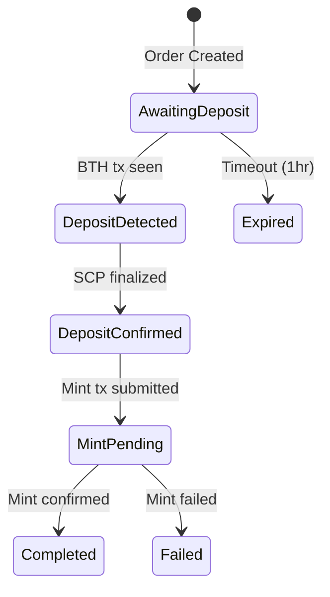
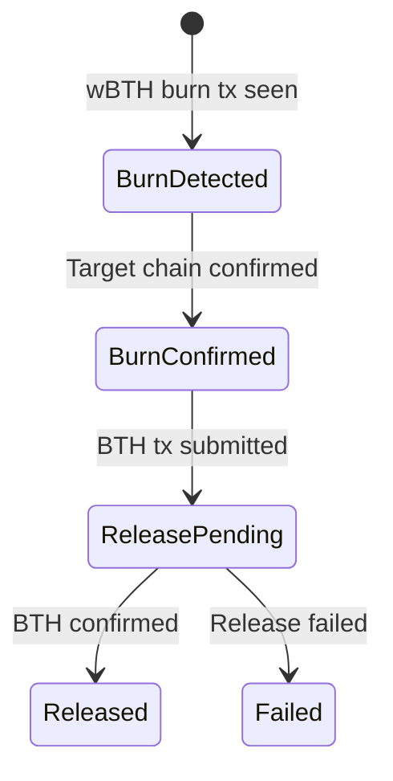

# Bridge Architecture

The BTH Bridge enables cross-chain transfers between Botho (BTH) and wrapped tokens (wBTH) on Ethereum and Solana.

## System Overview

```
┌─────────────────────────────────────────────────────────────────────────────┐
│                            Bridge Service                                    │
│                                                                              │
│  ┌─────────────┐  ┌─────────────┐  ┌─────────────┐  ┌─────────────────────┐ │
│  │ BTH Watcher │  │ ETH Watcher │  │   Engine    │  │  Order Processor    │ │
│  │             │  │             │  │             │  │                     │ │
│  │ - Deposits  │  │ - Burns     │  │ - Coord.    │  │ - Mint wBTH         │ │
│  │ - Confirms  │  │ - Confirms  │  │ - Shutdown  │  │ - Release BTH       │ │
│  └──────┬──────┘  └──────┬──────┘  └──────┬──────┘  └──────────┬──────────┘ │
│         │                │                │                     │            │
│         └────────────────┴────────────────┴─────────────────────┘            │
│                                      │                                       │
│                               ┌──────┴──────┐                                │
│                               │   Database   │                               │
│                               │   (SQLite)   │                               │
│                               └──────────────┘                               │
└─────────────────────────────────────────────────────────────────────────────┘
         │                           │                           │
         ▼                           ▼                           ▼
   ┌──────────┐               ┌──────────┐               ┌──────────┐
   │   BTH    │               │ Ethereum │               │  Solana  │
   │  Network │               │  (wBTH)  │               │  (wBTH)  │
   └──────────┘               └──────────┘               └──────────┘
```

## Supported Chains

| Chain | Token | Address Format | Confirmation |
|-------|-------|----------------|--------------|
| BTH | Native BTH | Base58 public address | SCP finality (instant) |
| Ethereum | wBTH (ERC-20) | 0x-prefixed hex (42 chars) | 12 blocks (~2.5 min) |
| Solana | wBTH (SPL) | Base58 (32-44 chars) | Finalized (~12 sec) |

## Order State Machine

The bridge uses a state machine to track transfer progress:

### Mint Flow (BTH → wBTH)



**State Descriptions:**
- `AwaitingDeposit` - Order created, waiting for user to send BTH
- `DepositDetected` - BTH transaction seen in mempool/block
- `DepositConfirmed` - BTH deposit finalized via SCP consensus
- `MintPending` - wBTH mint transaction submitted to target chain
- `Completed` - wBTH minted and confirmed

### Burn Flow (wBTH → BTH)



**State Descriptions:**
- `BurnDetected` - wBTH burn transaction detected on target chain
- `BurnConfirmed` - Burn confirmed with required confirmations
- `ReleasePending` - BTH release transaction submitted
- `Released` - BTH sent and confirmed

### Error States

- `Failed` - Order failed with error message (manual intervention needed)
- `Expired` - Deposit not received within timeout period (1 hour default)

## Core Components

### BridgeEngine (`bridge/service/src/engine.rs`)

The main coordinator that:
1. Spawns chain-specific watchers
2. Runs the order processing loop
3. Handles graceful shutdown

```rust
// Engine runs watchers and order processor concurrently
pub async fn run(self) -> Result<(), String> {
    // Spawn BTH watcher
    let bth_handle = tokio::spawn(bth_watcher.run());

    // Spawn Ethereum watcher
    let eth_handle = tokio::spawn(eth_watcher.run());

    // Run order processing loop every 10 seconds
    let process_handle = tokio::spawn(processor.process_pending_orders());

    // Wait for shutdown signal
    tokio::signal::ctrl_c().await;
}
```

### Chain Watchers

**BTH Watcher** (`bridge/service/src/watchers/bth.rs`):
- Monitors BTH network for incoming deposits
- Detects transactions with bridge memo identifiers
- Waits for SCP finality before confirming

**Ethereum Watcher** (`bridge/service/src/watchers/ethereum.rs`):
- Monitors wBTH contract for burn events
- Tracks confirmation depth (default: 12 blocks)
- Extracts BTH destination address from burn data

### Order Processor

Processes orders in actionable states:

1. **Confirmed Deposits** → Mint wBTH on target chain
2. **Confirmed Burns** → Release BTH to destination
3. **Stale Orders** → Mark as expired

### Database (`bridge/service/src/db.rs`)

SQLite storage for:
- Order records with full state history
- Rate limiting counters (per-address and global)
- Transaction hash mappings

## Configuration

### Bridge Settings (`bridge/core/src/config.rs`)

```toml
[bridge]
# Fee structure
fee_bps = 10              # 0.1% fee
min_fee = 100000000       # 0.0001 BTH minimum

# Rate limits (in picocredits, 12 decimals)
max_order_amount = 1000000000000000      # 1M BTH per order
daily_limit_per_address = 100000000000000  # 100k BTH/day per address
global_daily_limit = 10000000000000000    # 10M BTH/day global

# Timing
order_expiry_minutes = 60  # 1 hour timeout
max_retries = 3            # Retry failed operations
```

### Chain Configurations

**BTH Node:**
```toml
[bth]
rpc_url = "http://localhost:7101"
ws_url = "ws://localhost:7101/ws"
confirmations_required = 0  # SCP provides instant finality
```

**Ethereum:**
```toml
[ethereum]
rpc_url = "https://mainnet.infura.io/v3/..."
chain_id = 1
wbth_contract = "0x..."
confirmations_required = 12  # ~2.5 minutes
gas_price_strategy = "medium"
```

**Solana:**
```toml
[solana]
rpc_url = "https://api.mainnet-beta.solana.com"
wbth_program = "..."
commitment = "finalized"
```

## Fee Structure

### Fee Calculation

```
fee = max(amount * fee_bps / 10000, min_fee)
net_amount = amount - fee
```

| Amount | Fee Rate | Actual Fee | Net Amount |
|--------|----------|------------|------------|
| 1 BTH | 0.1% | 0.001 BTH | 0.999 BTH |
| 0.01 BTH | min fee | 0.0001 BTH | 0.0099 BTH |
| 100 BTH | 0.1% | 0.1 BTH | 99.9 BTH |

### Rate Limiting

**Per-Address Limits:**
- Maximum 100,000 BTH per address per 24 hours
- Prevents single actor from dominating bridge capacity

**Global Limits:**
- Maximum 10,000,000 BTH total per 24 hours
- Protects against coordinated attacks or exploits

## Order Identification

Orders are tracked using UUID-based memos:

```rust
// Generate 64-byte memo containing order UUID
pub fn generate_memo(&mut self) -> [u8; 64] {
    let mut memo = [0u8; 64];
    memo[..16].copy_from_slice(self.id.as_bytes());
    self.memo = Some(memo);
    memo
}
```

When users deposit BTH, they include the memo in the transaction. The BTH watcher extracts the order ID to match deposits to pending orders.

## Trust Model

### Current Implementation: Centralized Operator

The bridge currently operates with a **single operator model**:

- Bridge service holds hot wallet private keys
- Operator is trusted to process orders honestly
- Single point of failure for key compromise

**Trust Assumptions:**
1. Operator will not steal funds
2. Operator will process all valid orders
3. Operator maintains operational security

### Future Decentralization Options

| Option | Trust Model | Complexity | Security |
|--------|-------------|------------|----------|
| **Federated Signers** | N-of-M honest | Medium | Good |
| **MPC Threshold** | No single keyholder | High | Better |
| **ZK Light Client** | Trustless verification | Very High | Best |

See [Future Work](#future-work) for migration path.

## API Reference

### Order Types

```rust
pub enum OrderType {
    Mint,  // BTH → wBTH
    Burn,  // wBTH → BTH
}
```

### Order Status

```rust
pub enum OrderStatus {
    // Mint flow
    AwaitingDeposit,
    DepositDetected,
    DepositConfirmed,
    MintPending,
    Completed,

    // Burn flow
    BurnDetected,
    BurnConfirmed,
    ReleasePending,
    Released,

    // Error states
    Failed { reason: String },
    Expired,
}
```

### Status Helpers

```rust
// Check if order is in terminal state
status.is_terminal()  // Completed, Released, Failed, Expired

// Check if order needs processing
status.is_actionable()  // DepositConfirmed, MintPending, BurnConfirmed, ReleasePending
```

## Future Work

### Phase 1: Federated Signers (Planned)
- 3-of-5 multisig on Ethereum
- Multiple independent operators
- Reduces single point of failure

### Phase 2: MPC Threshold Signatures (Future)
- Distributed key generation
- No single party holds full key
- Higher security, more complexity

### Phase 3: ZK Light Client (Research)
- Verify BTH consensus on Ethereum
- Fully trustless bridge
- Highest gas costs

## Related Documentation

- [Security](security.md) - Hot wallet security and incident response
- [Transactions](../concepts/transactions.md) - BTH transaction format
- [API](../api.md) - RPC endpoints for bridge interaction
