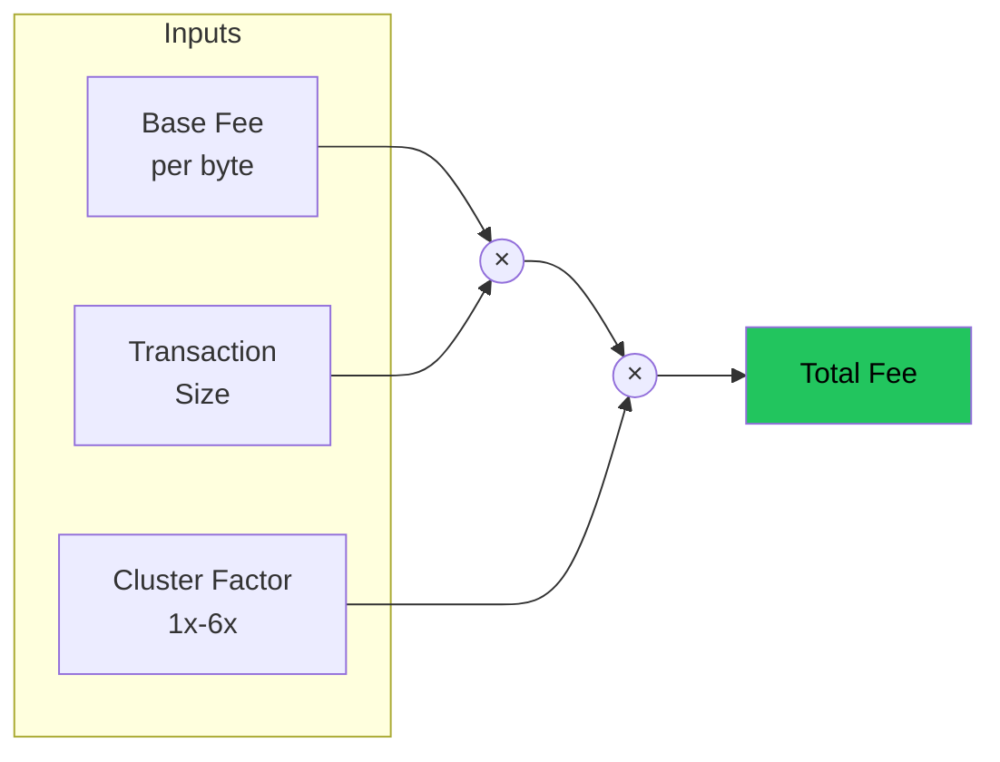

# Progressive Transaction Fees

Botho implements a novel **provenance-based progressive fee system** that taxes wealth concentration without enabling Sybil attacks or compromising privacy.


## The Problem

Traditional progressive taxation fails in cryptocurrency:

```
Naive approach: Fee rate based on transaction amount

Attack: Programmatic splitting defeats this instantly
  - Whale has 1,000,000 coins
  - Without splitting: 1 tx at 10% rate = 100,000 fee
  - With splitting: 1,000 txs at 1% rate = 10,000 total fee
  - Savings: 90% fee reduction via trivial split operation
```

Any amount-based progressive fee can be gamed by splitting.

## The Solution: Provenance Tags

Coins remember where they came from. The fee is based on **source wealth**, not current denomination.


### How It Works

1. **Clusters**: Each minting reward creates a unique cluster identity
2. **Source Wealth**: Every UTXO tracks the wealth of its original minter
3. **Persistence**: Splitting doesn't change source_wealth
4. **Blending**: Combining UTXOs creates a value-weighted average

### Key Properties

| Property | Behavior |
|----------|----------|
| **Split Resistant** | source_wealth unchanged by splitting |
| **Sybil Resistant** | source_wealth inherited by recipients |
| **Blend on Combine** | Multiple inputs → weighted average |
| **Natural Decay** | Legitimate commerce reduces effective wealth |

## Fee Calculation

The progressive multiplier is determined by a **sigmoid curve in log-wealth**:



**Formula**: `total_fee = base_fee × tx_size × cluster_factor × output_penalty + memo_fees`

The **cluster factor** (1x to 6x) is derived from the sender's source wealth using the curve below:


```
cluster_factor(W) = 1 + 5 × sigmoid((log2(W) − log2(w_mid)) / width)

w_mid = 100,000 BTH  (curve midpoint: factor 3.5x)
≲ 1K BTH   → ~1x     (base fee only)
≳ 10M BTH  → ~6x     (saturates)
```

Working in the **logarithm** of wealth (integer-only fixed point, for consensus determinism) gives the curve its S-shape across orders of magnitude:
- **Protects small clusters**: Flat ~1x across everyday wealth levels
- **Progressive middle**: Steepest around the 100K BTH midpoint
- **Caps the rich**: Saturates at 6x — a bounded premium, not confiscation

### Whale vs Poor: Same Transfer, Different Fees


The same ~4 KB transfer costs:
- **Whale-origin coins** (cluster wealth 10M BTH): 6× the base size fee
- **Well-circulated coins** (cluster wealth ≤ 1K BTH): 1× the base size fee

The premium attaches to the coins' provenance, so it follows whale money wherever it goes — no restructuring of holdings changes it.

## Why Sybil Attacks Don't Work

### Attack 1: Splitting
```
Whale splits 1M into 1000 × 1K UTXOs
Each UTXO: source_wealth = 1M (unchanged)
Each tx pays: factor(1M) = 6x — and the split itself pays
quadratic output penalties (up to 100x per transaction)
Result: Attack defeated (splitting costs extra, saves nothing)
```

### Attack 2: Sybil Shuffle
```
Whale creates 100 sybil accounts
Transfers 10K to each sybil
Each sybil's UTXO: source_wealth = 1M (inherited)
Sybils pay: factor(1M) = 6x
Result: Attack defeated
```

### Attack 3: Mixing with Poor Coins
```
Whale UTXO: value=100K, source_wealth=1M
Poor UTXO: value=1K, source_wealth=1K

Combined: blended source_wealth ≈ 990K (still ~99% of whale level)
Result: Minimal benefit from mixing
```

## Natural Decay Through Commerce

As coins circulate through legitimate economic activity, their source_wealth naturally decays toward the population average:


Circulating through merchants diffuses attribution two ways at once:
- Each **eligible hop** decays tags by 5%
- **Blending** with counterparties' coins dilutes attribution much faster than decay alone — a value-weighted average with every combined input

**This is by design**: Well-circulated money should pay lower fees than freshly-hoarded wealth.

## Simulation Results

We validated the progressive fee system through extensive simulation:


| Model | Gini Reduction | Burn Rate |
|-------|----------------|-----------|
| Flat 5% | -0.2353 | 9.1% |
| Linear 1%-15% | -0.2396 | 12.8% |
| Sigmoid | -0.2393 | 12.5% |
| 3-Segment | -0.2399 | 12.4% |

These early sweeps compared curve *shapes*; all performed within a fraction of a percent of each other. The **deployed** curve is the log-domain sigmoid (`ClusterFactorCurve`, midpoint 100K BTH), chosen in the M2 calibration for its smoothness across orders of magnitude and consensus-deterministic integer implementation; the full mechanism (fees + tilted lottery + emission routing + demurrage) passes its Gini-reduction criterion with a 4–11x margin (see `experiments/ANALYSIS.md`).

> **Note on "Burn Rate"**: the column above measures *fee intake* (fees collected as a fraction of value moved) in the original simulation, not the share of fees destroyed. In the shipped protocol, fees are **not** all burned — see **Where Fees Go** below.

## Where Fees Go: Redistribution Lottery + Burn (80/20)

Progressive fees are the *intake* side of Botho's anti-concentration design. The *outflow* side is a cluster-tilted redistribution lottery. Each block, collected fees (including the cluster-demurrage charges described below) are split deterministically by `LotteryFeeConfig` (`botho/src/consensus/lottery.rs`):

- **80% → redistribution lottery pool**, paid back out to randomly selected UTXO holders, with the draw tilted toward smaller, well-circulated holders.
- **20% → burned** (deflationary).

Only the 20% burn share is destroyed; the redistributed 80% stays in circulating supply as new payout UTXOs (audit cycle 6, M4). A height-scheduled fraction of the block reward is also routed into the same pool (`lottery_emission_share`), and the pool carries over between blocks under a per-block payout cap.

**Cluster demurrage** complements progressive fees by reaching *idle* wealth that a consumption tax cannot: concentrated-cluster coins accrue a small spend-time holding charge (factor-1 coins pay zero), which is added to the minimum fee and flows through the same 80/20 split into the lottery pool.

> **See also**: [Cluster-Tilted Redistribution](../design/cluster-tilted-redistribution.md), [Lottery-Based Fee Redistribution](../design/lottery-redistribution.md), [Entropy-Weighted Decay](../design/entropy-weighted-decay.md), and the [Tokenomics](tokenomics.md#fee-destination-redistribution-lottery--burn-8020) fee-destination summary.

## Privacy Considerations

### Phase 1: Public Tags
In the current implementation, source_wealth is visible on UTXOs. This enables:
- Direct fee verification
- Some provenance tracking (privacy tradeoff)

### Phase 2: Committed Tags (Planned)
Future implementation will hide tags using Pedersen commitments:
- Tag values hidden cryptographically
- Fee verification via zero-knowledge proofs
- Full privacy preserved

See [Privacy](privacy.md#progressive-transaction-fees) for detailed analysis.

## Parameters

| Parameter | Value | Description |
|-----------|-------|-------------|
| factor_min | 1x | Multiplier floor (small / well-circulated clusters) |
| factor_max | 6x | Multiplier ceiling (saturates for whale clusters) |
| w_mid | 100,000 BTH | Log-sigmoid midpoint (factor 3.5x) |
| Curve domain | log₂(cluster wealth) | Integer-only fixed point (consensus-deterministic) |
| Output penalty | quadratic, capped at 100x | Anti-UTXO-farming multiplier |
| Decay rate | 5% per eligible hop | Tag decay when UTXO meets age requirement |
| min_age_blocks | 720 blocks (~2 hours) | Minimum UTXO age for decay eligibility |

## Decay Mechanism: Age-Based Gating

Botho uses **age-based decay** to prevent wash trading attacks while preserving privacy.

### How It Works

1. **Age Check**: When spending a UTXO, the system checks if it's at least `min_age_blocks` (720) old
2. **If eligible**: Apply 5% tag decay
3. **If too young**: No decay (prevents rapid self-transfers)

### Natural Rate Limiting

Since new UTXOs must wait ~2 hours before decay applies, a wash trader can achieve at most:

```
max_decays_per_day = blocks_per_day / min_age_blocks
                   = 8640 / 720
                   = 12 decays/day
```

This bounds maximum daily decay to:
```
1 - 0.95^12 ≈ 46% per day
```

### Privacy Advantage

Unlike alternatives that track decay timing in UTXO metadata, age-based decay uses only the **UTXO creation block** — information that's already public on the blockchain. This means **zero additional metadata** is exposed:

| Metadata Field | Required? |
|----------------|-----------|
| `last_decay_block` | ❌ Not needed |
| `decays_this_epoch` | ❌ Not needed |
| `epoch_start_block` | ❌ Not needed |
| `utxo_creation_block` | ✅ Already public |

### Attack Resistance

| Attack | Transactions | Result |
|--------|--------------|--------|
| Rapid wash (1 minute) | 100 | 0% decay (all outputs too young) |
| Patient wash (1 day) | 1000 | ~46% decay (only ~12 eligible) |
| Patient wash (1 week) | 7000 | ~99% decay (84 eligible) — after paying ~84 fees |
| Holding without transacting | 0 | 0% decay (requires spending) |

> **See also**: [Cluster Tag Decay Design](../design/cluster-tag-decay.md) for mathematical proofs and simulation results.

## Economic Effects

### What Gets Taxed

| Scenario | Fee Level | Why |
|----------|-----------|-----|
| Whale spends directly | High (6x factor) | Fresh whale money |
| Whale's recipient spends | High (slightly decayed) | Still linked to whale origin |
| After many hops + blending | Low | Tags have decayed/mixed |
| Poor person spends their own | Low (1x factor) | Low source_wealth origin |

### Incentive Alignment

The system creates aligned incentives:
- **Circulation encouraged**: Moving money reduces fees over time
- **Hoarding discouraged**: Stagnant wealth pays maximum rates
- **Commerce rewarded**: Legitimate trade diffuses tags naturally
- **Privacy improves with velocity**: Well-circulated coins are harder to trace

## Technical Implementation

The progressive fee system is implemented in:
- `cluster-tax/src/fee_curve.rs` - Fee curve calculation
- `cluster-tax/src/crypto/committed_tags.rs` - Pedersen commitments for Phase 2
- `cluster-tax/src/crypto/validation.rs` - Tag conservation verification

Reference Python implementation: `cluster-tax/scripts/provenance_reference.py`

## Further Reading

- [Tokenomics](tokenomics.md) - Overall economic model
- [Privacy](privacy.md) - Privacy implications of cluster tags
- [Transactions](transactions.md) - Transaction structure and cluster tags
- [Issue #69](https://github.com/botho-project/botho/issues/69) - Phase 2 implementation tracking
