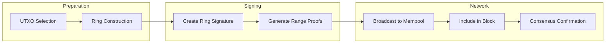
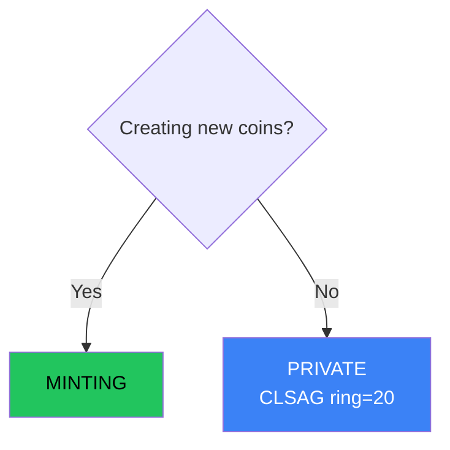

# Transaction Types

Botho supports two transaction types, each designed for specific use cases.

## Overview

| Property | Minting | Private |
|----------|---------|---------|
| **Purpose** | Block rewards | All transfers |
| **Recipient Privacy** | Hidden (stealth) | Hidden (stealth) |
| **Amount Privacy** | Public | Hidden |
| **Sender Privacy** | Known (minter) | Hidden (CLSAG ring) |
| **Stealth Address** | ML-KEM-768 | ML-KEM-768 |
| **Amount Encoding** | Plaintext | Pedersen + Bulletproofs |
| **Authorization** | ML-DSA-65 | CLSAG (ring size 20) |
| **Ring Size** | — | 20 decoys |
| **Max Inputs** | 1 | 16 |
| **Quantum Resistance** | Full | Recipient + Amount: full |
| **Approx. Size** | ~1.5 KB | ~4 KB |
| **Max Tx Size** | N/A | 100 KB |
| **Fee** | None | size-based |

### Transaction Flow

The following diagram shows the lifecycle of a private transaction:



**Steps explained:**
1. **UTXO Selection**: Choose unspent outputs to spend
2. **Ring Construction**: Select 19 decoys with similar cluster profiles
3. **Ring Signature**: Prove ownership of one ring member without revealing which
4. **Range Proofs**: Bulletproofs prove amounts are valid without revealing values
5. **Broadcast**: Transaction enters mempool and propagates via gossipsub
6. **Confirmation**: SCP consensus finalizes the block containing the transaction

## Output Format

All transaction types produce outputs with stealth addressing:

```
TxOutput {
    amount: u64,              // Hidden by Pedersen commitment
    target_key: [u8; 32],     // One-time Ristretto destination
    public_key: [u8; 32],     // Ephemeral DH key
    e_memo: Option<EncryptedMemo>,
    cluster_tags: ClusterTagVector,
}
```

## Cryptographic Primitives

| Primitive | Algorithm | Purpose | Size | Quantum Safety |
|-----------|-----------|---------|------|----------------|
| Stealth addresses | ML-KEM-768 | Recipient unlinkability | 1088 B ciphertext | Post-quantum |
| Amount commitments | Pedersen | Hide transaction amounts | 32 B | Hiding: unconditional |
| Range proofs | Bulletproofs | Prove amounts are valid | ~700 B | Classical |
| Minting auth | ML-DSA-65 | Authorize minting | 3309 B | Post-quantum |
| Ring signatures | CLSAG (ring=20) | Hide sender | ~700 B/input | Classical |
| Key images | x * Hp(P) | Prevent double-spending | 32 B | Classical |

---

## Minting Transactions

Minting transactions create new coins as block rewards. They have no inputs (coins come from the protocol itself).

### Properties

- **Inputs**: None (coinbase)
- **Outputs**: Stealth addresses with plaintext amounts
- **Authorization**: ML-DSA signature from the minter
- **Cluster**: Creates a new cluster origin

### Structure

```
MintingTx {
    block_height: u64,
    minter_proof: MinterProof,      // PoW solution + ML-DSA signature
    outputs: Vec<MintingOutput>,
    cluster_id: ClusterId,          // New cluster created by this mint
}

MintingOutput {
    target_key: PqStealthAddress,   // ML-KEM one-time destination
    public_key: MlKem768Ciphertext, // Ephemeral key for recipient
    amount: u64,                    // Plaintext (auditable)
    cluster_tag: ClusterTag,        // Initial tag weight = 1.0
}
```

### Why Amounts Are Public

Minting amounts must be publicly verifiable to:
- Audit total coin supply
- Verify emission schedule compliance
- Detect inflation bugs

Recipient privacy is still preserved via stealth addresses.

### Cluster Initialization

Each minting transaction creates a new cluster:
- Cluster ID derived from: `H(block_height || minter_pubkey || output_index)`
- Initial cluster tag weight: 1.0 (100%)
- All descendant coins inherit this cluster attribution

---

## Private Transactions (CLSAG)

Private transactions hide the sender within a ring of 20 possible signers using CLSAG ring signatures.

### Properties

- **Inputs**: Ring of 20 possible outputs + CLSAG ring signature
- **Outputs**: Stealth addresses with committed amounts
- **Authorization**: CLSAG ring signature (sender hidden among 20 members)
- **Amount Privacy**: Hidden via Pedersen commitments + Bulletproofs
- **Sender Privacy**: Hidden via ring signature (1-in-20 anonymity)
- **Quantum Resistance**: Recipient and amount privacy are PQ; sender anonymity is classical

### Structure

```
PrivateTx {
    inputs: Vec<ClsagRingInput>,
    outputs: Vec<TxOutput>,
    fee: u64,
    bulletproofs: AggregatedProof,
}

ClsagRingInput {
    ring: [RingMember; 20],         // 20 possible source outputs
    key_image: [u8; 32],            // Prevents double-spending
    commitment_key_image: [u8; 32], // For commitment balance proof
    clsag_signature: Vec<u8>,       // ~700 bytes
}
```

### CLSAG Ring Signatures

CLSAG (Concise Linkable Spontaneous Anonymous Group) provides:

| Property | Description |
|----------|-------------|
| **Sender anonymity** | Signature proves ownership of 1-of-20 outputs without revealing which |
| **Linkability** | Key images prevent double-spending without revealing the signer |
| **Classical security** | Based on discrete log (curve25519), ~128-bit classical security |
| **Ring size** | 20 members (larger than Monero's 16) |
| **Efficiency** | 45% smaller than MLSAG through response aggregation |

### Why CLSAG?

| Property | CLSAG | MLSAG |
|----------|-------|-------|
| Responses per ring member | 1 | 2 |
| Signature size (ring=20) | ~736 bytes | ~1,344 bytes |
| Security | Same | Same |
| Performance | Slightly faster | Baseline |

Compact signatures enable desktop-friendly blockchain growth (~100 GB/year).

### Key Images

Key images are deterministic values derived from the secret key:

```
key_image = x * Hp(P)  // 32 bytes
```

Properties:
- Same secret key always produces same key image
- Different secret keys produce different key images
- Cannot reverse-engineer secret key from key image
- Ledger maintains set of all spent key images

If a key image appears twice, the transaction is rejected as a double-spend.

### Decoy Selection (OSPEAD)

Private transactions use OSPEAD (Optimal Selection Probability to Evade Analysis of Decoys):

- **Gamma distribution**: Matches decoy ages to real spending patterns
- **Age-weighted selection**: Newer outputs more likely to be selected
- **Cluster similarity**: Prefers decoys with similar cluster tag profiles (≥70% cosine similarity)
- **Effective anonymity**: With ring size 20, achieves 10+ effective anonymity

Cluster-aware selection prevents fingerprinting attacks where an observer matches output cluster tags to specific inputs. By selecting decoys with similar cluster profiles, all ring members produce plausible output patterns.

---

## Stealth Addresses (All Types)

All transaction types use ML-KEM-768 stealth addresses for recipient privacy.

### Protocol

**Sender (creating output):**
1. Recipient publishes: ML-KEM public key `K`, spend public key `S`
2. Sender encapsulates shared secret: `(ciphertext, ss) = ML-KEM.Encapsulate(K)`
3. Sender derives scalar: `Hs = H(ss || output_index)`
4. Sender computes one-time destination: `target = Hs * G + S`
5. Output contains: `(target_key, ciphertext)`

**Recipient (scanning):**
1. For each output, decapsulate: `ss = ML-KEM.Decapsulate(ciphertext, kem_secret_key)`
2. Derive scalar: `Hs = H(ss || output_index)`
3. Compute expected target: `target' = Hs * G + S`
4. If `target' == target_key`, output belongs to recipient
5. Spending key: `x = Hs + spend_secret_key`

### Properties

- **Unlinkability**: Each output has unique one-time address
- **Post-quantum**: ML-KEM-768 provides ~192-bit PQ security
- **Scan efficiency**: Only view key needed to scan, spend key stays cold

---

## Amount Privacy

All transaction types except Minting hide amounts using Pedersen commitments and Bulletproofs.

### Pedersen Commitments

Each output amount is encoded as:
```
C = v*H + b*G
```

Where:
- `v` = amount value
- `b` = random blinding factor
- `H` = value generator point
- `G` = blinding generator point

**Properties:**
- **Hiding**: Cannot determine `v` from `C` (information-theoretic)
- **Binding**: Cannot find different `(v', b')` with same `C` (computational)
- **Homomorphic**: `C1 + C2 = (v1+v2)*H + (b1+b2)*G`

### Balance Verification

Transaction validity requires:
```
sum(input_commitments) = sum(output_commitments) + fee_commitment
```

The homomorphic property allows verification without revealing values.

### Bulletproofs Range Proofs

Bulletproofs prove each output amount is in range `[0, 2^64)`:

- **Prevents overflow**: Can't create negative amounts
- **Zero-knowledge**: Reveals nothing about actual value
- **Aggregatable**: Multiple proofs combine efficiently
- **Size**: ~700 bytes for single proof, sub-linear growth for batches

---

## Cluster Tags (All Types)

Cluster tags track coin ancestry for the progressive fee system.

### How Tags Work

- **Minting**: Creates new cluster with weight 1.0
- **Spending**: Tags are mixed proportionally from inputs
- **Decay**: ~5% decay per transaction hop

### Tag Mixing Example

```
Input A: 100 BTH, tags = {cluster_1: 0.8, cluster_2: 0.2}
Input B: 50 BTH, tags = {cluster_3: 1.0}

Output (150 BTH):
  cluster_1: (100/150) * 0.8 * 0.95 = 0.507
  cluster_2: (100/150) * 0.2 * 0.95 = 0.127
  cluster_3: (50/150) * 1.0 * 0.95 = 0.317
```

### Fee Calculation

Cluster wealth determines progressive fee rate:
```
cluster_wealth = sum(all_utxos * tag_weight)
fee_rate = sigmoid(cluster_wealth)  // 0.05% to 30%
```

---

## Transaction Fees

Botho uses **size-based fees** with a **progressive cluster factor**:

```
fee = fee_per_byte × tx_size × cluster_factor
```

| Type | Ring Size | Signature Size | Typical Total Size | Fee (1x cluster) | Fee (6x cluster) |
|------|-----------|----------------|-------------------|------------------|------------------|
| Minting | — | ~3.3 KB (ML-DSA) | ~1.5 KB | 0 | 0 |
| Private | 20 | ~0.7 KB (CLSAG) | ~4 KB | ~4,000 nanoBTH | ~24,000 nanoBTH |

### Transaction Limits

| Type | Ring Size | Max Inputs | Max Outputs | Max Tx Size |
|------|-----------|------------|-------------|-------------|
| Private | 20 | 16 | 16 | 100 KB |

The cluster factor (1x to 6x) discourages wealth concentration by increasing fees for wealthy clusters.

---

## Choosing a Transaction Type



### Summary

| If you need... | Use | Ring Size | Size | Fee |
|----------------|-----|-----------|------|-----|
| Block rewards | Minting | — | ~1.5 KB | 0 |
| All transfers | Private | 20 | ~4 KB | size-based |

Private transactions provide strong privacy for all transfers:
- **Recipient privacy**: PQ-safe (ML-KEM stealth addresses)
- **Amount privacy**: PQ-safe (information-theoretic Pedersen hiding)
- **Sender anonymity**: Classical (CLSAG ring signatures)

---

## Security Considerations

### Post-Quantum Security

Botho provides strong quantum resistance where it matters most:

| Component | Classical Security | Quantum Threat | Botho Protection |
|-----------|-------------------|----------------|------------------|
| Stealth addresses | ECDH | Shor's algorithm | ML-KEM-768 |
| Amount hiding | Pedersen | Grover (minimal) | Information-theoretic hiding |
| Minting signatures | Schnorr | Shor's algorithm | ML-DSA-65 |
| Ring signatures | CLSAG | Shor's algorithm | Classical (see rationale) |

**Why is classical CLSAG acceptable?**

1. **Recipient privacy is permanent** — stored forever on-chain, protected by ML-KEM-768
2. **Amount privacy is unconditional** — Pedersen hiding is information-theoretic, not computational
3. **Sender privacy is ephemeral** — value degrades over time; network-level attacks dominate
4. **Desktop accessibility** — compact transactions (~4 KB) enable widespread node operation

See [Why This Architecture?](privacy.md#why-this-architecture) for detailed rationale.

**Note on Pedersen commitments**: While quantum computers could break the binding property, this only allows creating invalid proofs—it does not reveal hidden amounts. The hiding property is information-theoretic and remains secure.

### Transaction Graph Analysis

| Attack | Private Transactions |
|--------|---------------------|
| Sender identification | Mitigated (1-in-20) |
| Amount correlation | Protected |
| Timing analysis | Partially vulnerable |
| Recipient identification | Protected (PQ) |
| Quantum HNDL (recipient) | Protected |
| Quantum HNDL (sender) | Classical only |

For maximum privacy, follow [privacy best practices](privacy.md#privacy-best-practices).

---

## Technical References

- [ML-KEM (FIPS 203)](https://csrc.nist.gov/pubs/fips/203/final) - Post-quantum key encapsulation
- [ML-DSA (FIPS 204)](https://csrc.nist.gov/pubs/fips/204/final) - Post-quantum signatures
- [CLSAG Paper](https://eprint.iacr.org/2019/654.pdf) - Concise Linkable Ring Signatures
- [Bulletproofs](https://eprint.iacr.org/2017/1066.pdf) - Range proofs
- [Pedersen Commitments](https://link.springer.com/content/pdf/10.1007/3-540-46766-1_9.pdf) - Commitment scheme
