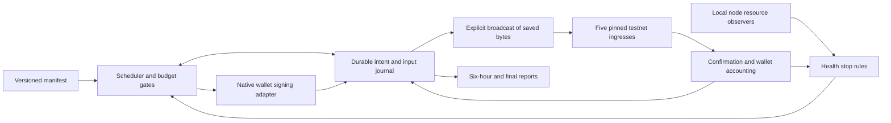

# Three-day testnet stress and recovery program

**Design date:** September 22, 2026. **Tracker:** [#1401](https://github.com/botho-project/botho/issues/1401).

**Status: design and offline schedule validation complete; execution is not activated.** The signer/controller, accounting oracle and live resource gates described here must pass implementation acceptance before scheduling this campaign. No start time is set. The previous overnight timers have expired.

## Objective and baseline

Establish confidence that the deployed native payment system preserves funds, handles repeated cold starts and increasing valid traffic, and recovers from client/node interruptions. Produce a reproducible capacity envelope and actionable failures for the full showcase work in [#1373](https://github.com/botho-project/botho/issues/1373).

The [overnight experiment](https://github.com/botho-project/botho/pull/1384) provides a useful baseline: three grants confirmed across all five hosts in 106–122 seconds; the last seed sync recovery extended full acceptance to 189 seconds. Across 815 local samples, node PIDs remained unchanged and swap stayed zero. Faucet idle RSS increased approximately 16 MiB across payments and flattened between them. This provides a baseline for low-rate native payments; wallet restore, sustained capacity, multiple miners, CT and actual web/Snap interoperability need additional evidence.

Freeze node source `6dbcb92463214694f3122a05c9c48986d4f4f1b7`, protocol `6.0.0`, genesis `9ba39a7a724ce1c954d9cbf9b83c019e898a5129ef5f485c0488a3fad6d396df`, feature flags, artifact hashes and effective configuration for the run. If [#1381](https://github.com/botho-project/botho/issues/1381) is fixed during the campaign, evaluate it as a separate candidate/run with the same scenarios. Do not mix an upgrade into the measurement series.

## 1. Schedule and budgets

`T0` is an explicit UTC timestamp selected after setup passes. The 72-hour deadline never moves after a restart, pause or missed event. A read-only drain/reconciliation window lasts at most another 30 minutes. Setup has its own eight-hour deadline and budget.

| Hours from T0 | Workload | Nominal payments | Advance only when |
|---|---|---:|---|
| 0–6 | Twelve spaced native transfers: receive/spend, change, controlled 2/4-input spends, restore/rescan and another spend. | 12 | Every intended shape is exercised and sender/recipient accounting agrees. |
| 6–24 | Payments at hours 6, 12 and 18; preserve the intervening idle periods. | 3 | Each cold start confirms and regains fleet sync; post-idle memory is recorded. |
| 24–36 | Six hours at one payment per 15 minutes, then six at one per five minutes. | 96 | No accumulating backlog or unresolved accounting; resource gates remain green. |
| 36–48 | Bursts of 2, 4 and 8 at hours 36/38/40; one-hour rate steps of 1/min at hour 42, 2/min at hour 44, 4/min at hour 46. Each step has a quiet drain period afterward. | 434 | Every previous step completes and reconciles; eligible inputs and RPC/resource headroom support the next. |
| 48–60 | Twenty-four transfers through rotating ingresses, clean wallet restore/handoff, and controlled client interruption recovery. Optional node drill has a separate gate below. | 24 | Restored clients recover correct funds, uncertain submissions reconcile, and history agrees. |
| 60–72 | Repeat 1/min for two hours; cold payments at hours 64, 68 and 71; final accounting and resource checks. | 123 | Earlier 1/min work passed; all remaining intents and balances reconcile. |
| **Total** | **Offered workload, before runtime skips or stops** | **692** | Coverage must be reported, not inferred from elapsed time. |

The higher rates are conservative initial probes, not claims of maximum network capacity. Exhaustion testing takes place on a separate deployment matching this topology and hardware. Change one load dimension at a time: signed transaction rate, input count, serialized bytes, or read traffic. CPU, memory and queue age supplement rate measurements because requests have different resource costs. [Google SRE: handling overload](https://sre.google/sre-book/handling-overload/)

### Hard bounds

- Eight dedicated test wallets. Transfers circulate **0.01, 0.03 or 0.10 BTH**, represented as integer picocredits, between those wallets.
- Funding ceiling **24 BTH**: up to 24 ordinary 1-BTH grants, no more than three per recipient in 24 hours, spaced at least 15 minutes apart. Existing suitable test funds may reduce this. Respect actual rate-limit responses and other users; do not rotate identities or API keys to evade a limit.
- Up to **64 setup transfers** to prepare/verify output inventory. Combined planned ceiling: **24 + 64 + 692 = 780 unique chain-write intents**, under a hard **800-intent** cap. The 20-intent margin is not automatically filled. Supplemental traffic requires a revised manifest.
- Harness-signed fees: **0.5 BTH total**, **0.005 BTH per transaction**, reserving actual signed fees before broadcast. Include dust absorption and protocol holding charges in the accounting. Faucet grant fees are recorded separately: `faucet_request` cannot impose a caller-selected fee cap.
- Global maximum **8 unresolved signed payments**, **1 per wallet**; phase limits are lower where specified. At most 8 queued intents, with a 120-second start grace. An unresolved intent reserves its inputs and fee budget until reconciled.
- Normal rate ≤4 new submissions/minute; the three enumerated bursts allow up to 8 submissions at one-second spacing. Signed payload ≤256 KiB, aggregate submitted payload ≤2 MiB/minute. These are harness limits and must not relax protocol limits.
- All reads, retries, signing lookups, local observer polls and writes share a per-node limiter across HTTPS/local aliases: ≤50 calls/minute and no more than half the endpoint's advertised quota. Honor `Retry-After`; reserve polling capacity. Insufficient RPC allowance becomes a measured driver limitation, not hidden failover traffic.
- No automatic rebroadcast, fresh replacement transaction or catch-up burst. Work missed during downtime is recorded as skipped. A failed stage blocks escalation; continuing at a lower rate requires an explicit revised run decision.

The [manifest](../../scripts/stress/testnet-72h-plan.json) encodes this schedule and these limits. The [offline planner](../../scripts/stress/plan.py) checks schedule windows and budgets and expands deterministic intent IDs; it has no network/signing/execution path. Runtime enforcement is separate implementation work.

## 2. Setup: remove wallet starvation as a confounder

The production thin wallet's [ring sourcing](../../botho-wallet/src/ring_builder.rs) requires **real inputs at least ten blocks old**, enough eligible ring members, and exclusion of real inputs from decoys. Wall-clock waiting alone does not age an output on an idle chain. The faucet's high-balance pause policy remains unchanged.

Before T0, require at least **four independently spendable outputs per wallet / 32 total**, with fees, input age and decoy availability checked through the actual production signer. This is an initial inventory target, not proof it sustains every offered rate. Record available, reserved, immature and rejected-input counts throughout the run. Forecast the next stage's inventory from measured block cadence and input consumption; if insufficient, stop at `inventory_exhausted` and report the achieved workload. Do not reduce the age floor or reuse a reserved/spent output to meet a traffic target.

Prepare outputs through the bounded ordinary funding/setup transfers. The eight-hour setup budget includes necessary block progression. If the chain's pause/maturity interaction prevents readiness within the budget, record that as a product constraint. No extra grants, monetary cap change or surprise mining worker is allowed to manufacture readiness.

Use new experiment wallets with recoverable backups and a fixed recipient allowlist. No existing node, faucet or bridge wallet key is copied into the harness. Run signing on a separate always-on controller host with its own measured resource limits; the laptop may sleep. Host selection and provisioning are a launch gate. Wallet keys never appear in manifests, process arguments, environment dumps or public logs. A restore must validate the same address, owned outputs and spent state before that wallet resumes sending.

## 3. Program components and durable submission



### Native adapter

Use the production wallet's scanning, fee, ring and signing paths. [TransactionBuilder::build_transfer_with_metadata](../../botho-wallet/src/transaction.rs) already returns signed bytes' source transaction, actual fee and selected-input metadata before submission; `to_tx_hex` provides the node encoding. A narrow Rust adapter should expose structured `scan`, `prepare`, `inspect` and `restore-check` operations. It must return the **canonical transaction hash**, not an unrelated hash of a JSON/hex representation. Inspect actual shape and fee before reserving the final budget.

The existing [CLI send](../../botho-wallet/src/commands/send.rs) combines build and broadcast, prompts for wallet access, accepts a floating-point CLI amount, and prints human output. It is not the orchestration contract. The current [RpcPool](../../botho-wallet/src/rpc_pool.rs) discovers addresses and automatically fails over, so an explicit TLS endpoint allowlist and complete request accounting are required for the adapter. Verify genesis/protocol/build independently on every permitted ingress. Cache/checkpoint scans with a full-rescan comparison; bound output-range queries and response size. Never patch transaction rules to make the workload pass.

### Intent state machine

`planned → eligible → prepared → submitting → accepted/unknown → confirmed → recipient_verified → reconciled`

Terminal outcomes also include `skipped`, `rejected`, `expired`, `aborted` and `unresolved`. Persist every transition with a timestamp and reason.

1. One controller owns a filesystem lock and SQLite journal. Atomically reserve a deterministic intent ID, inputs and prospective fee under global/phase/wallet limits.
2. Build once. Persist exact signed bytes, canonical hash, selected inputs, actual fee, recipient and change metadata before any network submission. Fsync the artifact and journal; orphaned prepared files are reconciled before reuse.
3. Mark `submitting` durably, then send the stored bytes through one recorded ingress. Verify a returned hash matches the local canonical hash.
4. A lost reply becomes `unknown`. Search by that hash across the fleet and inspect spent-input state. Never rebuild the payment from its amount/address. No automatic retry is part of this public manifest. A later reviewed identical-byte resubmission keeps the same intent/hash and gets its own request record.
5. A controller crash must preserve unresolved reservations. Recovery queries existing hashes before enabling new work. Resume cannot shift T0, reset budgets, refill missed slots or silently change node/software identity.

Fund-once faucet requests remain at most once because their API does not accept caller-signed bytes or an idempotency token. If a grant reply is lost, reconcile via recipient scan/history; block repeated funding for that slot.

### Scheduler semantics

The offered schedule is fixed. Dispatch requires healthy endpoints, fresh observations, available mature inputs, budget and capacity. Do not wait for each confirmation before recording the next offered slot: that would hide overload. When dispatch is blocked, record queue time and the limiting reason; skip after the grace period. No more than one unresolved spend may own a wallet/input set. Percentiles must include scheduled-to-completion delay and timeout/skip counts alongside submission-to-confirmation timings.

## 4. Independent acceptance checks

For each accepted payment, verify the canonical hash in a block on all five nodes, then separately verify recipient ownership/value, sender change, fee and spent-input state using wallet scans. Compare block hashes **at the same finalized height**; different current tips during ordinary propagation are not sufficient fork evidence. Initial acceptance may be recorded before full fleet synchronization, with both timestamps retained.

At each phase boundary, stop admission, drain and check the full experiment inventory. Starting assets + confirmed external funding/receipts must equal ending owned value + explicit external outflows + fees/other actual protocol charges. Internal transfers cancel. Separately track pending, immature, reserved and missing outputs. Record unexpected receipts, awards and dust; do not count unexplained differences as rounding. Use native integer arithmetic and the deployed accounting rules. Periodic fresh-profile/full scans must agree with the incremental view. This is independent operational reconciliation, not a proof of the cryptographic construction.

Capture these times separately: offered slot, scan begin/end, input readiness, signing, durable preparation, HTTP submission/response, first node acceptance, inclusion, confirmation on all five, recipient discovery, and full sync recovery. Report sample count, median/p95/max and censored/failed observations per stage, transaction shape and cold/warm category. Three cold samples alone do not support a strong p99 claim.

## 5. Observability and automatic stops

Extend the overnight local observers to record every **60 seconds while idle**, every **5 seconds during activity and for five minutes afterward**. They must sample resources independently of RPC completion so a blocked event loop cannot hide memory pressure. Store timestamps even when RPC fails. Collect:

- PID/start time, automatic restarts, RSS/service peak/swap, `MemAvailable`, disk space, CPU, load/pressure and queue age.
- Peers, effective quorum membership/thresholds, common finalized checkpoint, height, mempool size/oldest age, actual minting state and measured initialization timing where instrumentation exists.
- HTTPS/RPC latency, statuses/429s/timeouts, per-method calls/bytes and observed limits; signer/controller CPU, memory and scan cache statistics.
- Input inventory, outstanding-intent age and all financial budgets.

The controller must receive fresh per-host observations over a restricted read-only metric channel (for example a dedicated SSH key restricted to exporting collector records). It must not possess the operator's unrestricted SSH key. If that channel is unavailable, resource gating is unavailable and load admission stops. Independent journals and final direct host checks supplement sampled data.

| Trigger | Required action |
|---|---|
| Network/genesis/build change, unexpected node restart, contradictory finalized checkpoint, accounting mismatch or suspected duplicate/conflicting spend | Stop new work immediately; preserve evidence and verify the finding. No automatic repair. |
| A submitted payment unconfirmed after 5 minutes | Pause admission and retain its input reservation. |
| Any signed/submitted intent still unresolved after 15 minutes | Stop the run as incomplete; continue bounded read-only reconciliation. |
| An expected node remains unsynced for 2 minutes, or any required observation is >60 seconds old | Pause admission; do not continue an uninformed load ramp. |
| Host available memory below the greater of 15% or 256 MiB for two active samples | Pause admission. |
| Node process swap exceeds 64 MiB for 2 minutes | Pause admission and capture memory/pressure evidence. |
| Free disk below the greater of 20% or 2 GiB | Stop admission before storage exhaustion. |
| Post-idle RSS is >64 MiB **and** >20% above the established idle baseline for three cycles | Hold escalation for memory review. |
| Funding/fee/request/byte/concurrency limits, 429, insufficient eligible inputs | Enforce the relevant cap/backoff; report rejected or skipped offers. Never bypass it. |
| End time or operator stop marker | Stop new signatures/submissions; bounded read-only drain and final report. |

These are initial experiment thresholds based on the deployed host sizes and overnight latency, not production SLAs. High mining CPU alone is expected; it is not an automatic failure. A health pause requires explicit review/resume, while ordinary per-request quota backoff remains within its original event window. The controller does not restart nodes, clear mempools, alter fees/difficulty/quorums, increase faucet limits or erase data to recover.

## 6. Recovery and isolated fault work

The public manifest automatically exercises **client-side** failures: change the selected ingress between payments, restore into a clean profile under a single-writer handoff, and interrupt the controller after durable preparation/after submission to verify journal recovery. Prove these crash points on a local fixture before repeating them with test funds.

A one-node public recovery drill is an optional operator-run scenario, disabled by default. Before it can run, capture the actual effective quorum graph and producer configuration, identify a surviving quorum, select one non-producing node, take a consistent backup, and specify a maximum ten-minute outage plus return/catch-up deadline. Observe the stopped node as expected-down in that exact interval; every other gate still applies. Rejoining must recover the same history without a reset. Do not assume that five connected nodes imply any particular fault tolerance. SCP's quorum/blocking-set semantics determine expected progress. [SCP overview](https://developers.stellar.org/docs/learn/fundamentals/stellar-consensus-protocol)

Use a separate cluster with the same binaries, protocol, resource limits and intended quorum topology for the following:

- Fresh genesis/snapshot catch-up, crash/reopen and ledger-backup restoration. Copying a database alone is not proof that the node can reconstruct and validate history.
- Loss of the sole producer, followed by producer restart; then a reviewed two-producer experiment. Expect production to pause while no producer is available. Measure competition and convergence with actual networking/mining.
- Network delay, packet loss, asymmetric partitions and loss of quorum. Require safety and consistent recovery; safe halted progress under a blocking set is an expected outcome.
- Duplicate identical transactions, two distinct transactions spending the same inputs, invalid signatures and malformed bodies. Conflicting spends must never both finalize; resource use stays bounded on rejection.
- Deliberate memory/disk pressure and a rate ramp to the first capacity limit. Never aim this traffic or fault injection at the shared public endpoints.

Keep lab results separate from public-network acceptance. Any smaller scale, trivial PoW or altered clock/resource assumption is recorded and limits the inference to the deployed testnet.

## 7. Client and privacy coverage

The native program supplies the initial repeatable workload. Once [#1377](https://github.com/botho-project/botho/issues/1377) proves funded production Snap sends and wallet fixes [#1378](https://github.com/botho-project/botho/pull/1378)/[#1379](https://github.com/botho-project/botho/pull/1379) complete review, substitute identified slots in the correctness/recovery phases with real web/Snap round trips and approval/restore flows. A headless signer call is not browser/MetaMask acceptance. Record skipped client coverage explicitly and do not extend the budget to hide it.

Confidential amounts, LotteryV2 consumers and independent crypto/whitepaper review remain under [#1307](https://github.com/botho-project/botho/issues/1307), [#1308](https://github.com/botho-project/botho/issues/1308), [#1309](https://github.com/botho-project/botho/issues/1309) and [#1310](https://github.com/botho-project/botho/issues/1310). Repeat relevant workload/invalid-proof/privacy observations against that future identified candidate; this protocol-6 run cannot close those gates.

## 8. Evidence, delivery and implementation order

Every six hours, generate a local report containing scheduled/eligible/prepared/submitted/confirmed/reconciled/skipped/unresolved counts; offered and achieved rates; latency stages; exact financial reconciliation; input starvation; per-host resources/restarts/sync; observed warning categories; and breaker decisions. A daily report compares cold-start cycles and post-idle memory. Collector export is bounded and rotated; full signed bytes and wallet-linked input metadata stay protected. Published evidence uses transaction IDs, software/configuration digests, sanitized host metrics and a checksummed manifest. No automatic Slack/email/chat delivery is configured.

Implementation order, with a gate at each step:

1. **Native automation adapter and accounting ([#1402](https://github.com/botho-project/botho/issues/1402)):** prepare/hash/inspect without submit; pinned TLS reads; integer amounts; actual fee/shape checks; recoverable dedicated wallets; exact received/change/spent reconciliation. Prove receive → spend → restore → spend on an isolated real node first.
2. **Durable scheduler and resource gates:** SQLite/byte artifacts, single-writer reservations, independent observers, all budget/time constraints and report generation. Test crashes at every durable-write/submit boundary, uncertain replies, stale observations, missing maturity, wrong network, overlapping wallets and deadline expiry. Build a fake-clock campaign that reaches every breaker without real funds.
3. **Public canary and setup:** select the always-on host, pin artifacts/configuration, prepare bounded mature inventory, then perform a few qualifying transfers inside the setup budget. Validate observer overhead and the reconciliation oracle. Freeze the final manifest and explicit T0/end timestamps only when these gates pass.
4. **Execute the 72-hour schedule:** compare checkpoints at 6/24/36/48/60/72 hours. A stopped/incomplete run is useful evidence and does not automatically resume. Lab failures are separate runs.
5. **Review:** attach results to the Loom tracker, file concrete regressions, and state which client/privacy/recovery cases were actually covered. Report the highest demonstrated workload with transaction sizes/shapes and hardware, without extrapolating TPS.

### Validate the design locally

```sh
python3 scripts/stress/plan.py --output /tmp/botho-stress-plan
python3 -m unittest discover -s scripts/stress -p 'test_plan.py'
```

The [validated plan summary](testnet-stress-plan-summary.json) records 692 campaign payments, up to 780 total planned chain-write intents, and a minimum initial inventory of 32 mature outputs. Eight tests cover date-free design mode, budgets, funding limits, phase windows, offered rate/concurrency, maturity and public-fault restrictions. This static validation does not implement or certify runtime circuit breakers. The JSON deliberately has `status: design_only`, `run_id: null` and `start_utc: null`.
