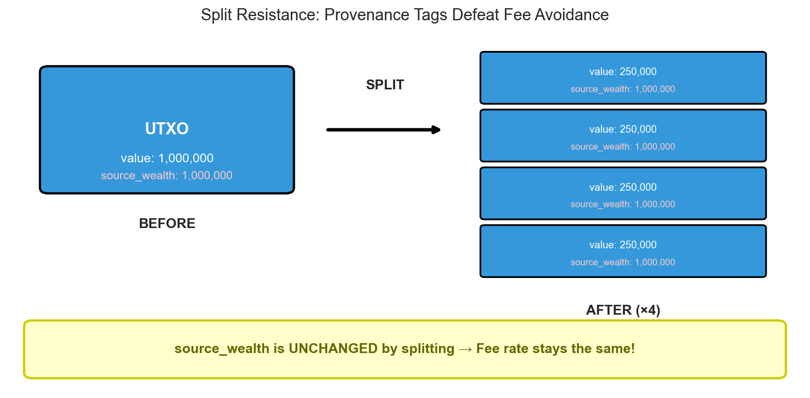

# Progressive Transaction Fees

Botho implements a novel **provenance-based progressive fee system** that taxes wealth concentration without enabling Sybil attacks or compromising privacy.


## The Problem

Traditional progressive taxation fails in cryptocurrency:

```
Naive approach: Fee rate based on transaction amount

Attack: Programmatic splitting defeats this instantly
  - Whale has 1,000,000 coins
  - Without splitting: 1 tx at 10% rate = 100,000 fee
  - With splitting: 1,000 txs at 1% rate = 10,000 total fee
  - Savings: 90% fee reduction via trivial split operation
```

Any amount-based progressive fee can be gamed by splitting.

## The Solution: Provenance Tags

Coins remember where they came from. The fee is based on **source wealth**, not current denomination.



### How It Works

1. **Clusters**: Each minting reward creates a unique cluster identity
2. **Source Wealth**: Every UTXO tracks the wealth of its original minter
3. **Persistence**: Splitting doesn't change source_wealth
4. **Blending**: Combining UTXOs creates a value-weighted average

### Key Properties

| Property | Behavior |
|----------|----------|
| **Split Resistant** | source_wealth unchanged by splitting |
| **Sybil Resistant** | source_wealth inherited by recipients |
| **Blend on Combine** | Multiple inputs → weighted average |
| **Natural Decay** | Legitimate commerce reduces effective wealth |

## Fee Calculation

The fee rate is determined by a **3-segment piecewise linear curve**:


```
Segment 1 (Poor):   [0, 15% of max)    → 1% flat rate
Segment 2 (Middle): [15%, 70% of max)  → 2% to 10% linear
Segment 3 (Rich):   [70%+ of max]      → 15% flat rate
```

This S-curve design:
- **Protects the poor**: Low, flat rate up to 15% of max wealth
- **Progressive middle**: Steepest progression where most redistribution occurs
- **Caps the rich**: Plateau prevents extreme burden while ensuring contribution

### Whale vs Poor: Same Transfer, Different Fees


A 10,000 BTH transfer costs:
- **Whale** (source: 1M): 1,500 BTH (15% rate)
- **Poor** (source: 10K): 114 BTH (1.1% rate)
- **Ratio**: 13.2× higher fees for whale-origin coins

## Why Sybil Attacks Don't Work

### Attack 1: Splitting
```
Whale splits 1M into 1000 × 1K UTXOs
Each UTXO: source_wealth = 1M (unchanged)
Each tx pays: rate(1M) = 15%
Total fees: same as unsplit
Result: Attack defeated
```

### Attack 2: Sybil Shuffle
```
Whale creates 100 sybil accounts
Transfers 10K to each sybil
Each sybil's UTXO: source_wealth = 1M (inherited)
Sybils pay: rate(1M) = 15%
Result: Attack defeated
```

### Attack 3: Mixing with Poor Coins
```
Whale UTXO: value=100K, source_wealth=1M
Poor UTXO: value=1K, source_wealth=1K

Combined: blended source_wealth ≈ 990K (still ~99% of whale level)
Result: Minimal benefit from mixing
```

## Natural Decay Through Commerce

As coins circulate through legitimate economic activity, their source_wealth naturally decays toward the population average:


After 10 transaction hops through merchants:
- Initial source_wealth: 1,000,000
- Final source_wealth: ~104,000 (90% decay)
- Mixing with merchant coins accelerates decay vs pure 5%/hop

**This is by design**: Well-circulated money should pay lower fees than freshly-hoarded wealth.

## Simulation Results

We validated the progressive fee system through extensive simulation:


| Model | Gini Reduction | Burn Rate |
|-------|----------------|-----------|
| Flat 5% | -0.2353 | 9.1% |
| Linear 1%-15% | -0.2396 | 12.8% |
| Sigmoid | -0.2393 | 12.5% |
| **3-Segment** | **-0.2399** | **12.4%** |

The 3-segment model achieves:
- **0.3% better** inequality reduction than sigmoid
- **0.1% lower** burn rate than sigmoid
- **ZK-compatible** (provable with ~4.5 KB OR-proofs)

## Privacy Considerations

### Phase 1: Public Tags
In the current implementation, source_wealth is visible on UTXOs. This enables:
- Direct fee verification
- Some provenance tracking (privacy tradeoff)

### Phase 2: Committed Tags (Planned)
Future implementation will hide tags using Pedersen commitments:
- Tag values hidden cryptographically
- Fee verification via zero-knowledge proofs
- Full privacy preserved

See [Privacy](privacy.md#progressive-transaction-fees) for detailed analysis.

## Parameters

| Parameter | Value | Description |
|-----------|-------|-------------|
| w1 (poor/middle boundary) | 15% of max | Below this: flat 1% rate |
| w2 (middle/rich boundary) | 70% of max | Above this: flat 15% rate |
| r_poor | 1% | Rate for poor segment |
| r_mid_start | 2% | Rate at start of middle segment |
| r_mid_end | 10% | Rate at end of middle segment |
| r_rich | 15% | Rate for rich segment |
| Decay rate | 5% per eligible hop | Tag decay when UTXO meets age requirement |
| min_age_blocks | 720 blocks (~2 hours) | Minimum UTXO age for decay eligibility |

## Decay Mechanism: Age-Based Gating

Botho uses **age-based decay** to prevent wash trading attacks while preserving privacy.

### How It Works

1. **Age Check**: When spending a UTXO, the system checks if it's at least `min_age_blocks` (720) old
2. **If eligible**: Apply 5% tag decay
3. **If too young**: No decay (prevents rapid self-transfers)

### Natural Rate Limiting

Since new UTXOs must wait ~2 hours before decay applies, a wash trader can achieve at most:

```
max_decays_per_day = blocks_per_day / min_age_blocks
                   = 8640 / 720
                   = 12 decays/day
```

This bounds maximum daily decay to:
```
1 - 0.95^12 ≈ 46% per day
```

### Privacy Advantage

Unlike alternatives that track decay timing in UTXO metadata, age-based decay uses only the **UTXO creation block** — information that's already public on the blockchain. This means **zero additional metadata** is exposed:

| Metadata Field | Required? |
|----------------|-----------|
| `last_decay_block` | ❌ Not needed |
| `decays_this_epoch` | ❌ Not needed |
| `epoch_start_block` | ❌ Not needed |
| `utxo_creation_block` | ✅ Already public |

### Attack Resistance

| Attack | Transactions | Result |
|--------|--------------|--------|
| Rapid wash (1 minute) | 100 | 0% decay (all outputs too young) |
| Patient wash (1 day) | 1000 | 46% decay (only 12 eligible) |
| Patient wash (1 week) | 7000 | 97% decay (84 eligible) |
| Holding without transacting | 0 | 0% decay (requires spending) |

> **See also**: [Cluster Tag Decay Design](design/cluster-tag-decay.md) for mathematical proofs and simulation results.

## Economic Effects

### What Gets Taxed

| Scenario | Fee Level | Why |
|----------|-----------|-----|
| Whale spends directly | High (15%) | Fresh whale money |
| Whale's recipient spends | High (decayed) | Still linked to whale origin |
| After 20 hops | Low | Tags have decayed/mixed |
| Poor person spends their own | Low (1%) | Low source_wealth origin |

### Incentive Alignment

The system creates aligned incentives:
- **Circulation encouraged**: Moving money reduces fees over time
- **Hoarding discouraged**: Stagnant wealth pays maximum rates
- **Commerce rewarded**: Legitimate trade diffuses tags naturally
- **Privacy improves with velocity**: Well-circulated coins are harder to trace

## Technical Implementation

The progressive fee system is implemented in:
- `cluster-tax/src/fee_curve.rs` - Fee curve calculation
- `cluster-tax/src/crypto/committed_tags.rs` - Pedersen commitments for Phase 2
- `cluster-tax/src/crypto/validation.rs` - Tag conservation verification

Reference Python implementation: `cluster-tax/scripts/provenance_reference.py`

## Further Reading

- [Tokenomics](tokenomics.md) - Overall economic model
- [Privacy](privacy.md) - Privacy implications of cluster tags
- [Transactions](transactions.md) - Transaction structure and cluster tags
- [Issue #69](https://github.com/botho-project/botho/issues/69) - Phase 2 implementation tracking
