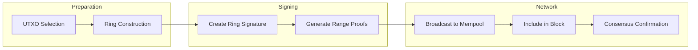
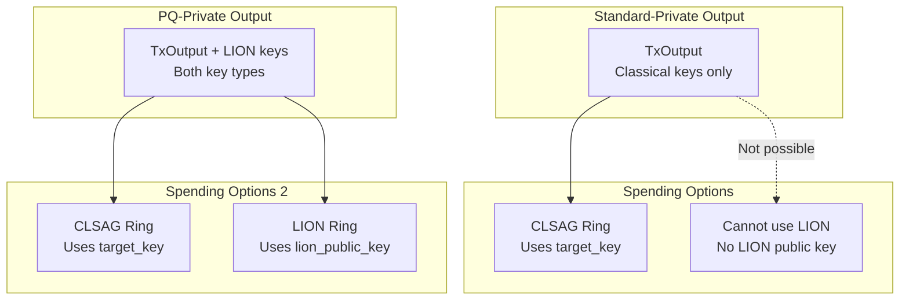
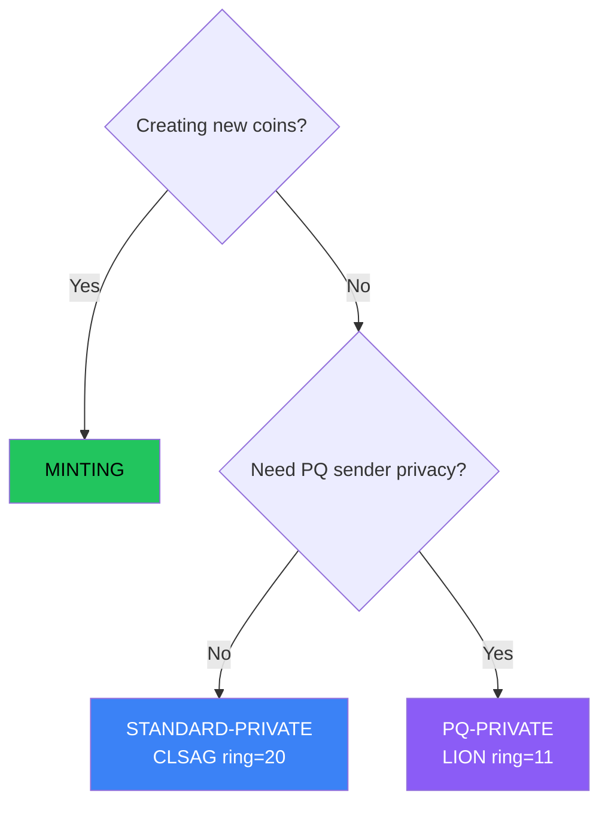

# Transaction Types

Botho supports three transaction types, each designed for specific use cases with different privacy, efficiency, and quantum-resistance trade-offs.

## Overview

| Property | Minting | Standard-Private | PQ-Private |
|----------|---------|------------------|------------|
| **Purpose** | Block rewards | Daily transactions | Maximum privacy |
| **Recipient Privacy** | Hidden (stealth) | Hidden (stealth) | Hidden (stealth) |
| **Amount Privacy** | Public | Hidden | Hidden |
| **Sender Privacy** | Known (minter) | Hidden (CLSAG ring) | Hidden (LION ring) |
| **Stealth Address** | ML-KEM-768 | ML-KEM-768 | ML-KEM-768 |
| **Amount Encoding** | Plaintext | Pedersen + Bulletproofs | Pedersen + Bulletproofs |
| **Authorization** | ML-DSA-65 | CLSAG (ring size 20) | LION (ring size 11) |
| **Ring Size** | — | 20 decoys | 11 decoys |
| **Max Inputs** | 1 | 16 | 8 |
| **Quantum Resistance** | Full | Recipient: full, Sender: classical | Full |
| **Approx. Size** | ~1.5 KB | ~4 KB | ~65 KB |
| **Max Tx Size** | N/A | 100 KB | 512 KB |
| **Fee** | None | size-based | size-based |

### Transaction Flow

The following diagram shows the lifecycle of a private transaction:



**Steps explained:**
1. **UTXO Selection**: Choose unspent outputs to spend
2. **Ring Construction**: Select decoys (19 for CLSAG, 10 for LION) with similar cluster profiles
3. **Ring Signature**: Prove ownership of one ring member without revealing which
4. **Range Proofs**: Bulletproofs prove amounts are valid without revealing values
5. **Broadcast**: Transaction enters mempool and propagates via gossipsub
6. **Confirmation**: SCP consensus finalizes the block containing the transaction

## Why Two Privacy Tiers?

The main difference between Standard-Private and PQ-Private is the **ring signature scheme** (sender privacy):

| Tier | Ring Signature | Ring Size | Size/Input | Quantum Resistance |
|------|----------------|-----------|------------|-------------------|
| Standard-Private | CLSAG | 20 | ~0.7 KB | Classical only |
| PQ-Private | LION | 11 | ~36 KB | Full (lattice-based) |

**Why use ML-KEM stealth addresses in all tiers?**

Recipient privacy is permanent — transactions are recorded forever on-chain. A quantum attacker in 2045 could retroactively link recipients from 2025 transactions if we used classical ECDH. The ~1 KB overhead of ML-KEM-768 is worthwhile for quantum-resistant recipient unlinkability.

**Why offer classical CLSAG for sender privacy?**

Sender privacy is ephemeral — the value of knowing "who sent this" diminishes over time as the economic context becomes historical. LION signatures are ~90x larger than CLSAG, which isn't justified for everyday transactions.

**When to use PQ-Private?**

Users who need quantum-resistant sender privacy should use PQ-Private: whistleblowers, political dissidents, long-term holdings, or high-value transactions where "harvest now, decrypt later" attacks are a concern.

## UTXO and Privacy Tier Relationship

Understanding how outputs relate to privacy tiers is important for users choosing between Standard-Private (CLSAG) and PQ-Private (LION) transactions.

### Output Format

All transaction types produce outputs with stealth addressing:

```
TxOutput {
    amount: u64,              // Hidden by Pedersen commitment
    target_key: [u8; 32],     // One-time Ristretto destination
    public_key: [u8; 32],     // Ephemeral DH key
    e_memo: Option<EncryptedMemo>,
    cluster_tags: ClusterTagVector,
}
```

### Ring Signature Requirements

The two ring signature schemes have different key requirements:

| Scheme | Ring Members Need | Key Size | Notes |
|--------|------------------|----------|-------|
| CLSAG | Ristretto points (`target_key`) | 32 bytes | Uses existing TxOutput keys |
| LION | LION lattice public keys | 1,312 bytes | Requires additional key material |

**Key insight:** LION ring signatures require LION public keys for all ring members. These are lattice-based keys that cannot be derived from classical Ristretto points.

### Tier Transition



### What This Means for Users

| Current UTXO | Want to Use | Action Required |
|--------------|-------------|-----------------|
| Standard-Private | CLSAG | Direct spend (default) |
| Standard-Private | LION | Spend to PQ address first, then spend with LION |
| PQ-Private | CLSAG | Direct spend (cheaper) |
| PQ-Private | LION | Direct spend (quantum-safe) |

### Migration Path

To upgrade existing Standard-Private UTXOs to support LION spending:

1. Spend your Standard-Private UTXOs using CLSAG (normal transaction)
2. Send to your own PQ-enabled address (creates outputs with LION key material)
3. Future spends from these outputs can use either CLSAG or LION

This is what the `botho-wallet migrate-to-pq` command automates. See [Post-Quantum Migration Guide](pq-migration.md) for details.

### Why This Architecture?

1. **Efficiency**: Standard-Private outputs are compact (no 1,312-byte LION keys)
2. **Backward compatibility**: Classical outputs work with existing infrastructure
3. **Forward compatibility**: PQ outputs support both signature schemes
4. **User choice**: Upgrade when quantum resistance is needed, not before

## Cryptographic Primitives

| Primitive | Algorithm | Purpose | Size | Quantum Safety |
|-----------|-----------|---------|------|----------------|
| Stealth addresses | ML-KEM-768 | Recipient unlinkability | 1088 B ciphertext | Post-quantum |
| Amount commitments | Pedersen | Hide transaction amounts | 32 B | Hiding: unconditional |
| Range proofs | Bulletproofs | Prove amounts are valid | ~700 B | Classical |
| Minting auth | ML-DSA-65 | Authorize minting | 3309 B | Post-quantum |
| Classical ring sig | CLSAG (ring=20) | Hide sender (Standard-Private) | ~700 B/input | Classical |
| PQ ring sig | LION (ring=11) | Hide sender (PQ-Private) | ~36 KB/input | Post-quantum |
| Key images | Scheme-derived | Prevent double-spending | 32 B (CLSAG), 1312 B (LION) | Matches scheme |

---

## Minting Transactions

Minting transactions create new coins as block rewards. They have no inputs (coins come from the protocol itself).

### Properties

- **Inputs**: None (coinbase)
- **Outputs**: Stealth addresses with plaintext amounts
- **Authorization**: ML-DSA signature from the minter
- **Cluster**: Creates a new cluster origin

### Structure

```
MintingTx {
    block_height: u64,
    minter_proof: MinterProof,      // PoW solution + ML-DSA signature
    outputs: Vec<MintingOutput>,
    cluster_id: ClusterId,          // New cluster created by this mint
}

MintingOutput {
    target_key: PqStealthAddress,   // ML-KEM one-time destination
    public_key: MlKem768Ciphertext, // Ephemeral key for recipient
    amount: u64,                    // Plaintext (auditable)
    cluster_tag: ClusterTag,        // Initial tag weight = 1.0
}
```

### Why Amounts Are Public

Minting amounts must be publicly verifiable to:
- Audit total coin supply
- Verify emission schedule compliance
- Detect inflation bugs

Recipient privacy is still preserved via stealth addresses.

### Cluster Initialization

Each minting transaction creates a new cluster:
- Cluster ID derived from: `H(block_height || minter_pubkey || output_index)`
- Initial cluster tag weight: 1.0 (100%)
- All descendant coins inherit this cluster attribution

---

## Standard-Private Transactions (CLSAG)

Standard-Private transactions hide the sender within a ring of 20 possible signers using CLSAG ring signatures. This is the recommended default for most transactions.

### Properties

- **Inputs**: Ring of 20 possible outputs + CLSAG ring signature
- **Outputs**: Stealth addresses with committed amounts
- **Authorization**: CLSAG ring signature (sender hidden among 20 members)
- **Amount Privacy**: Hidden via Pedersen commitments + Bulletproofs
- **Sender Privacy**: Hidden via ring signature (1-in-20 anonymity)
- **Quantum Resistance**: Recipient privacy is PQ (ML-KEM), sender privacy is classical

### Structure

```
StandardPrivateTx {
    inputs: Vec<ClsagRingInput>,
    outputs: Vec<TxOutput>,
    fee: u64,
    bulletproofs: AggregatedProof,
}

ClsagRingInput {
    ring: [RingMember; 20],         // 20 possible source outputs
    key_image: [u8; 32],            // Prevents double-spending
    commitment_key_image: [u8; 32], // For commitment balance proof
    clsag_signature: Vec<u8>,       // ~700 bytes
}
```

### CLSAG Ring Signatures

CLSAG (Concise Linkable Spontaneous Anonymous Group) provides:

| Property | Description |
|----------|-------------|
| **Sender anonymity** | Signature proves ownership of 1-of-20 outputs without revealing which |
| **Linkability** | Key images prevent double-spending without revealing the signer |
| **Classical security** | Based on discrete log (curve25519), ~128-bit classical security |
| **Ring size** | 20 members (larger than Monero's 16) |
| **Efficiency** | 45% smaller than MLSAG through response aggregation |

### Why CLSAG over MLSAG?

| Property | CLSAG | MLSAG |
|----------|-------|-------|
| Responses per ring member | 1 | 2 |
| Signature size (ring=20) | ~736 bytes | ~1,344 bytes |
| Security | Same | Same |
| Performance | Slightly faster | Baseline |

### Use Cases

- **Daily transactions**: The default choice for most transfers
- **Good privacy/efficiency balance**: 20-member ring with compact signatures
- **When quantum sender privacy isn't critical**: Most adversaries today are classical

---

## PQ-Private Transactions (LION)

PQ-Private transactions provide maximum privacy by hiding the sender within a ring of 11 possible signers using LION post-quantum ring signatures.

### Properties

- **Inputs**: Ring of 11 possible outputs + LION ring signature
- **Outputs**: Stealth addresses with committed amounts
- **Authorization**: LION ring signature (sender hidden among 11 members)
- **Amount Privacy**: Hidden via Pedersen commitments + Bulletproofs
- **Sender Privacy**: Hidden via ring signature (1-in-11 anonymity)
- **Quantum Resistance**: Full (both recipient and sender privacy are PQ)

### Structure

```
PqPrivateTx {
    inputs: Vec<LionRingInput>,
    outputs: Vec<TxOutput>,
    fee: u64,
    bulletproofs: AggregatedProof,
}

LionRingInput {
    ring: [RingMember; 11],         // 11 possible source outputs
    key_image: [u8; 1312],          // LION key image (larger than CLSAG)
    lion_signature: Vec<u8>,        // ~36 KB per input
}
```

### LION Ring Signatures

LION (Lattice-based lInkable ring signatures fOr aNonymity) provides:

| Property | Description |
|----------|-------------|
| **Sender anonymity** | Signature proves ownership of 1-of-11 outputs without revealing which |
| **Linkability** | Key images prevent double-spending without revealing the signer |
| **Post-quantum security** | Based on Module-LWE, ~128-bit PQ security level |
| **Ring size** | 11 members |

### Key Images

Key images are deterministic values derived from the secret key:

```
key_image = LION.KeyImage(secret_key)  // 1312 bytes for LION
```

Properties:
- Same secret key always produces same key image
- Different secret keys produce different key images
- Cannot reverse-engineer secret key from key image
- Ledger maintains set of all spent key images

If a key image appears twice, the transaction is rejected as a double-spend.

### Decoy Selection (OSPEAD)

Both Standard-Private and PQ-Private use OSPEAD (Optimal Selection Probability to Evade Analysis of Decoys):

- **Gamma distribution**: Matches decoy ages to real spending patterns
- **Age-weighted selection**: Newer outputs more likely to be selected
- **Cluster similarity**: Prefers decoys with similar cluster tag profiles (≥70% cosine similarity)
- **Effective anonymity**: With ring size 20, achieves 10+ effective anonymity

Cluster-aware selection prevents fingerprinting attacks where an observer matches output cluster tags to specific inputs. By selecting decoys with similar cluster profiles, all ring members produce plausible output patterns.

### Use Cases

- **High-value transfers**: When privacy is worth the higher fee (1.0%)
- **Long-term privacy**: Protection against "harvest now, decrypt later" attacks
- **Whistleblowing**: When anonymity must withstand future quantum attacks
- **Political dissidents**: When adversaries may have future quantum capabilities

---

## Stealth Addresses (All Types)

All transaction types use ML-KEM-768 stealth addresses for recipient privacy.

### Protocol

**Sender (creating output):**
1. Recipient publishes: ML-KEM public key `K`, spend public key `S`
2. Sender encapsulates shared secret: `(ciphertext, ss) = ML-KEM.Encapsulate(K)`
3. Sender derives scalar: `Hs = H(ss || output_index)`
4. Sender computes one-time destination: `target = Hs * G + S`
5. Output contains: `(target_key, ciphertext)`

**Recipient (scanning):**
1. For each output, decapsulate: `ss = ML-KEM.Decapsulate(ciphertext, kem_secret_key)`
2. Derive scalar: `Hs = H(ss || output_index)`
3. Compute expected target: `target' = Hs * G + S`
4. If `target' == target_key`, output belongs to recipient
5. Spending key: `x = Hs + spend_secret_key`

### Properties

- **Unlinkability**: Each output has unique one-time address
- **Post-quantum**: ML-KEM-768 provides ~192-bit PQ security
- **Scan efficiency**: Only view key needed to scan, spend key stays cold

---

## Amount Privacy

All transaction types except Minting hide amounts using Pedersen commitments and Bulletproofs.

### Pedersen Commitments

Each output amount is encoded as:
```
C = v*H + b*G
```

Where:
- `v` = amount value
- `b` = random blinding factor
- `H` = value generator point
- `G` = blinding generator point

**Properties:**
- **Hiding**: Cannot determine `v` from `C` (information-theoretic)
- **Binding**: Cannot find different `(v', b')` with same `C` (computational)
- **Homomorphic**: `C1 + C2 = (v1+v2)*H + (b1+b2)*G`

### Balance Verification

Transaction validity requires:
```
sum(input_commitments) = sum(output_commitments) + fee_commitment
```

The homomorphic property allows verification without revealing values.

### Bulletproofs Range Proofs

Bulletproofs prove each output amount is in range `[0, 2^64)`:

- **Prevents overflow**: Can't create negative amounts
- **Zero-knowledge**: Reveals nothing about actual value
- **Aggregatable**: Multiple proofs combine efficiently
- **Size**: ~700 bytes for single proof, sub-linear growth for batches

---

## Cluster Tags (All Types)

Cluster tags track coin ancestry for the progressive fee system.

### How Tags Work

- **Minting**: Creates new cluster with weight 1.0
- **Spending**: Tags are mixed proportionally from inputs
- **Decay**: ~5% decay per transaction hop

### Tag Mixing Example

```
Input A: 100 BTH, tags = {cluster_1: 0.8, cluster_2: 0.2}
Input B: 50 BTH, tags = {cluster_3: 1.0}

Output (150 BTH):
  cluster_1: (100/150) * 0.8 * 0.95 = 0.507
  cluster_2: (100/150) * 0.2 * 0.95 = 0.127
  cluster_3: (50/150) * 1.0 * 0.95 = 0.317
```

### Fee Calculation

Cluster wealth determines progressive fee rate:
```
cluster_wealth = sum(all_utxos * tag_weight)
fee_rate = sigmoid(cluster_wealth)  // 0.05% to 30%
```

---

## Transaction Fees

Botho uses **size-based fees** with a **progressive cluster factor**:

```
fee = fee_per_byte × tx_size × cluster_factor
```

| Type | Ring Size | Signature Size | Typical Total Size | Fee (1x cluster) | Fee (6x cluster) |
|------|-----------|----------------|-------------------|------------------|------------------|
| Minting | — | ~3.3 KB (ML-DSA) | ~1.5 KB | 0 | 0 |
| Standard-Private | 20 | ~0.7 KB (CLSAG) | ~4 KB | ~4,000 nanoBTH | ~24,000 nanoBTH |
| PQ-Private | 11 | ~36 KB (LION) | ~65 KB | ~65,000 nanoBTH | ~390,000 nanoBTH |

### Transaction Limits

| Type | Ring Size | Max Inputs | Max Outputs | Max Tx Size |
|------|-----------|------------|-------------|-------------|
| Standard-Private | 20 | 16 | 16 | 100 KB |
| PQ-Private | 11 | 8 | 16 | 512 KB |

PQ-Private transactions use a smaller ring size (11 vs 20) and fewer max inputs (8 vs 16) to keep transaction sizes manageable while still providing strong privacy (3.30 bits, 95% efficiency).

The cluster factor (1x to 6x) discourages wealth concentration by increasing fees for wealthy clusters.

---

## Choosing a Transaction Type



### Summary

| If you need... | Use | Ring Size | Size | Fee |
|----------------|-----|-----------|------|-----|
| Block rewards | Minting | — | ~1.5 KB | 0 |
| Privacy (everyday) | Standard-Private | 20 | ~4 KB | size-based |
| Privacy (quantum-safe) | PQ-Private | 11 | ~65 KB | size-based |

### Quick Decision Guide

**Use Standard-Private (recommended default) when:**
- You want sender privacy for everyday transactions
- Classical adversaries are your threat model
- Good balance of privacy and efficiency
- Most transactions should use this type

**Use PQ-Private when:**
- Long-term privacy is critical (10+ year horizon)
- Your adversary may have quantum computers in the future
- Whistleblowing, political dissent, or sensitive high-value transfers
- "Harvest now, decrypt later" is a concern

---

## Security Considerations

### Post-Quantum Security

All transaction types provide strong quantum resistance where it matters most:

| Component | Classical Security | Quantum Threat | Botho Protection |
|-----------|-------------------|----------------|------------------|
| Stealth addresses | ECDH | Shor's algorithm | ML-KEM-768 (all types) |
| Amount hiding | Pedersen | Grover (minimal) | Information-theoretic hiding |
| Minting signatures | Schnorr | Shor's algorithm | ML-DSA-65 |
| Standard-Private ring | CLSAG | Shor's algorithm | Classical (acceptable trade-off) |
| PQ-Private ring | — | — | LION (full PQ) |

**Why is classical CLSAG acceptable?**

1. **Recipient privacy is permanent** — stored forever on-chain. We use ML-KEM-768 for all transaction types.
2. **Sender privacy is ephemeral** — the value degrades over time. LION's 90x size overhead isn't justified for everyday use.
3. **Users who need PQ sender privacy** can explicitly choose PQ-Private transactions.

**Note on Pedersen commitments**: While quantum computers could break the binding property, this only allows creating invalid proofs—it does not reveal hidden amounts. The hiding property is information-theoretic and remains secure.

### Transaction Graph Analysis

| Attack | Standard-Private | PQ-Private |
|--------|------------------|------------|
| Sender identification | Mitigated (1-in-20) | Mitigated (1-in-11) |
| Amount correlation | Protected | Protected |
| Timing analysis | Partially vulnerable | Partially vulnerable |
| Recipient identification | Protected | Protected |
| Quantum HNDL (sender) | Vulnerable (future) | Protected |
| Quantum HNDL (recipient) | Protected | Protected |

For maximum privacy, use PQ-Private transactions and follow [privacy best practices](privacy.md#privacy-best-practices).

---

## Technical References

- [ML-KEM (FIPS 203)](https://csrc.nist.gov/pubs/fips/203/final) - Post-quantum key encapsulation
- [ML-DSA (FIPS 204)](https://csrc.nist.gov/pubs/fips/204/final) - Post-quantum signatures
- [CLSAG Paper](https://eprint.iacr.org/2019/654.pdf) - Concise Linkable Ring Signatures
- [LION Ring Signatures](https://link.springer.com/chapter/10.1007/978-981-95-3540-8_17) - Lattice-based linkable ring signatures
- [Bulletproofs](https://eprint.iacr.org/2017/1066.pdf) - Range proofs
- [Pedersen Commitments](https://link.springer.com/content/pdf/10.1007/3-540-46766-1_9.pdf) - Commitment scheme
